# 一、变量类型和计算
---
> 1. JS中使用typeof能得到的哪些类型
> 1. 何时使用`===`何时使用`==`
> 1. JS中有哪些内置函数
> 1. JS变量按照存储方式区分为哪些类型，并描述其特点
> 1. 如何理解JSON

## 变量类型
JS中有7种内置类型，7种内置类型又分为两大类型
- 基本类型/值类型：`null`、`undefined`、`boolean`、`number`、`string`、`symbol`
- 对象/引用类型：`object`
### 基本类型/值类型
**是什么**

把每一个值存放在对应变量内存的位置，数据分块存放在内存中，数据之间不会相互影响
```js
var a = 100;
var b = a;
a = 200;
console.log(b); // 100
```
**条件**

原始类型存储的都是值，是没有函数可以调用的，比如`undefined.toString()`
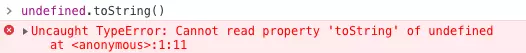
 `'1'.toString()` 是可以使用的。在这种情况下，`'1'` 已经不是原始类型了，而是被强制转换成了 `String` 类型（大写）也就是引用类型，所以可以调用 `toString` 函数
 
JS 的`number` 类型是浮点类型的，在使用中会遇到某些 Bug
- `NaN`也属于`number`类型，并且`NaN`不等于自身
- `0.1 + 0.2 !== 0.3`

`string`类型是不可变的，无论你在`string`类型上调用何种方法，都不会对值有改变

对于`null`来说，很多人会认为他是个引用类型，其实这是错误的。虽然 `typeof null` 会输出 `object`，但是这只是 JS 存在的一个悠久 Bug。在 JS 的最初版本中使用的是 **32 位系统**，为了性能考虑使用**低位存储**变量的类型信息，`000` 开头代表是对象，然而 `null` 表示为全零，所以将它错误的判断为 `object` 。虽然现在的内部类型判断代码已经改变了，但是对于这个 Bug 却是一直流传下来

### 对象/引用类型
**是什么**

当你创建了一个引用类型a的时候，计算机会在内存中帮我们开辟一个空间来存放值，但是我们需要找到这个空间，这个空间会拥有一个地址（指针），引用类型a存储的就是这个地址 
```js
const a = [];
```
对于常量 `a` 来说，假设内存地址（指针）为 `#001`，那么在地址 `#001` 的位置存放了值 `[]`，常量 `a` 存放了地址（指针） `#001`

当我们将变量赋值给另外一个变量时，复制的是原本变量的地址（指针），也就是说当前变量 `b` 存放的地址（指针）也是 `#001`，当我们进行数据修改的时候，就会修改存放在地址（指针） `#001` 上的值，也就导致了两个变量的值都发生了改变
```js
const a = []
const b = a
b.push(1)
```

**产生原因**

若a赋值成一个对象，特别大，a再赋值给b，b也会占很大的空间，不合理，所以引用类型是为了让内存共用空间，好几个变量共用1个内存块，节省内存空间，赋值只是变量指针的赋值，并不是每次赋值都把对象真正的值复制一份，所以值的修改相互干预

**分类边界**

数组`array`、函数`function`、对象`object`

**目的**

无限制扩展属性，比如说对象有个age属性，可以加第2个属性name属性

**组合**
深浅拷贝

**条件**

函数参数是对象的情况
```js
function test(person) {
  person.age = 26
  person = {
    name: 'yyy',
    age: 30
  }
  return person;
}

const p1 = {
  name: 'yck',
  age: 25
}

const p2 = test(p1)
console.log(p1) // -> ?
console.log(p2) // -> ?
```

- 首先，函数传参是传递对象指针的副本
- 到函数内部修改参数的属性这步，我相信大家都知道，当前 `p1` 的值也被修改了
- 但是当我们重新为 `person` 分配了一个对象时就出现了分歧，请看下图

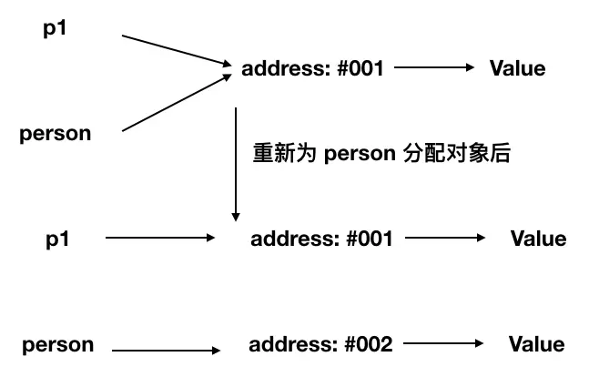

所以最后 `person` 拥有了一个新的地址（指针），也就和 `p1` 没有任何关系了，导致了最终两个变量的值是不相同的

## typeof运算符
**是什么**

只能区分基本类型的详细类型，引用类型无法细分

**分类边界**

`typeof`对于基本类型来说，除了`null`都可以显示正确的类型
```js
typeof null // 'object' BUG
typeof undefined // 'undefined'
typeof true // 'boolean'
typeof 1 // 'number'
typeof '1' // 'string'
typeof Symbol() // 'symbol'
```
`typeof`对于引用类型来说，除了函数都会显示`object`，所以说`typeof`并不能准确判断引用变量到底是什么类型。因为函数是一个十分特殊的引用类型，在JS中函数的地位非常高，所以需要在任何地方轻松判断出这个是函数，所以typeof单独把函数列出来
```js
typeof [] // 'object'
typeof {} // 'object'
typeof console.log // 'function'
```

**组合**

instanceof


## 类型转换

**是什么**

在JS中类型转换只有三种情况
- 转换为布尔值
- 转换为数字
- 转换为字符串

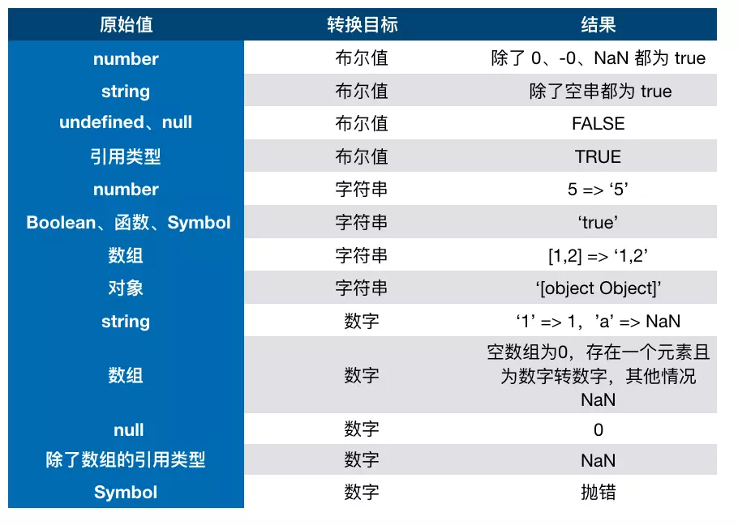
**组合**

### 转Boolean
在条件判断时，除了`undefined`、`null`、`false`、`NaN`、`''`、`0`、`-0`，其他所有值都转为`true`，包括所有对象

### 引用类型转基本类型
引用类型在转换类型的时候，会调用内置的 `[[ToPrimitive]]` 函数，对于该函数来说，算法逻辑一般来说如下
- 如果已经是基本类型了，那就不需要转换了
- 调用 `x.valueOf()`，如果转换为基础类型，就返回转换的值
- 调用 `x.toString()`，如果转换为基础类型，就返回转换的值
- 如果都没有返回基本类型，就会报错

当然你也可以重写 `Symbol.toPrimitive` ，该方法在转原始类型时调用优先级最高
```js
let a = {
  valueOf() {
    return 0
  },
  toString() {
    return '1'
  },
  [Symbol.toPrimitive]() {
    return 2
  }
}
1 + a // => 3
```

### 四则运算
**目的**

- 字符串拼接
- 运算

**组合**

- 加法运算中一方为字符串，那么就会把另一方也转换为字符串
- 加法运算中一方不是数字或字符串，那么会将它转换为数字或字符串
```js
1 + '1' // '11'
true + true // 2
4 + [1,2,3] // "41,2,3"
```
- 对于第一行代码来说，触发特点一，所以将数字 `1` 转换为字符串，得到结果 `'11'`
- 对于第二行代码来说，触发特点二，所以将 `true` 转为数字 `1`
- 对于第三行代码来说，触发特点二，所以将数组通过 `toString` 转为字符串 `1,2,3`，得到结果 `41,2,3`

**条件**

对于加法还需要注意这个表达式 `'a' + + 'b'`
```js
'a' + + 'b' // -> "aNaN"
```
因为 `+ 'b'` 等于 `NaN`，所以结果为 `"aNaN"`

**Tips**

- 用 `+ '1'` 的形式来快速获取 `number` 类型
- 用`!!`判断变量会被当做`true`还是`false`

那么对于除了加法的运算符来说，只要其中一方是数字，那么另一方就会被转为数字
```js
4 * '3' // 12
4 * [] // 0
4 * [1, 2] // NaN
```

### 比较运算符

**是什么**
== > < !=

**组合**

如果是对象，就通过 `toPrimitive` 转换对象
如果是字符串，就通过 `unicode` 字符索引来比较
```js
let a = {
  valueOf() {
    return 0
  },
  toString() {
    return '1'
  }
}
a > -1 // true
```
在以上代码中，因为 `a` 是对象，所以会通过 `valueOf` 转换为原始类型再比较值

## 题目解答
> 1. JS中使用typeof能得到的哪些类型

typeof可以识别6种数据类型：number、string、boolean、object、function、undefined

> 2. 何时使用`===`何时使用`==`

**使用jQuery源码中推荐的写法**，当obj.a为null或undefined时，看一个对象的属性是否存在或看一个函数的参数是否存在，但对象和形参必须定义，否则会报错，可简写使用`==`，除此外一律用`===`
```js
// 看一个对象的属性是否存在
if(obj.a == null) {
  // 相当于obj.a === null || obj.a ===undefined，简写形式
}

// 看一个函数的参数是否存在
function(a, b) {
  if(a == null) {...}
}
```

> 3. JS中有哪些内置函数（数据封装类对象）

都是函数
- Boolean、Number、String、**Object**、**Array**、**Function**、Date、RegExp、Error（一定要大写）

内置对象
- Math、JSON
> 4. JS变量按照存储方式区分为哪些类型，并描述其特点

基本类型：数据分块存放在内存中，数据不会相互干涉
```js
var a = 100;
var b = a;
a = 200;
console.log(b); //100
```
引用类型：好几个变量共用1个内存块，节省内存空间，赋值只是变量指针的赋值，并不是真正值的拷贝，所以值的修改相互干预
```js
var a = {age:20};
var b = a;
b.age = 21;
conlose.log(a.age) //21
```

> 5. 如何理解JSON

- JSON只不过是一个JS对象而已
- JSON也是一种数据格式
- Math也是JS对象
```js
JSON.stringify({a:10,b:20}) //将对象转换为字符串
JSON.parse('{"a":10,"b":20}') //将字符串变为对象
```

# 二、原型与原型链
---
> 1. 如何准确判断一个变量是数组类型
> 1. 写一个原型链继承的例子
> 1. 描述new一个对象的过程
> 1. zepto（或其他框架）源码中如何使用原型链

## 构造函数
- 构造函数首字母大写
- 构造函数类似于模板
### new一个构造函数，返回一个对象的过程
1. new的时候把参数传入也可不传
2. new函数执行时，创建一个空对象
3. this指向这个新对象`this = {}`
4. 执行代码，即对this.name等开始顺序赋值
5. 赋值完后，默认return this
6. 赋值给`f`，`f.name`、`f.age`、`f.class`生效
```js
function Foo(name, age){
  this.name = name;
  this.age = age;
  this.class = 'class-1';
  // return this    //默认有这一行
}
var f = new Foo('zhangsan', 20);
// var f1 = new Foo('lisi', 23); 可创建多个对象
```
### Tips
- `var obj = {}`其实是`var obj = new Object()`的语法糖
- `var arr = []`其实是`var arr = new Array()`的语法糖
- `var fn = funtion () {...}`其实是`var fn = new Function()`的语法糖
- 所有的引用类型（对象、数组、函数）都有构造函数
- 推荐使用前者的写法

## 原型
### 5条原型规则和示例
1. **所有**的引用类型（数组、对象、函数），都具有**对象**特性，即可自由扩展属性（`null`除外）
```js
var obj ={};
obj.a = 100 ;
var arr = [];
arr.a = 100;
var fn = function () {};
fn.a = 100;
```

2. **所有的引用类型**，都有一个`__proto__`属性（隐式原型属性），属性值是一个普通的**对象**
```js
console.log(obj.__proto__);
console.log(arr.__proto__);
console.log(fn.__proto__);
```

3. **所有函数**，都有一个`prototype`属性（显式原型属性），属性值是一个普通的**对象**
- Number、String、Boolean、**Object**、**Array**、**Function**、Date、RegExp、Error（一定要大写）都是函数
```js
console.log(fn.prototype);
```

4. **所有引用类型**，`__proto__`属性值指向（完全等===）他的构造函数的`prototype`属性值
```js
console.log(obj.__proto__ === Object.prototype)
```

5. 当试图得到一个对象的某个属性时，若果这个对象本身没有这个属性，那么在它的`__proto__`（即它的构造函数的`prototype`）中寻找
```js
// 构造函数
function Foo(name, age){
  this.name = name;
}
Foo.prototype.alertName = function () {
  alert(this.name);
}
// 创建实例
var f = new Foo('zhangsan');
f.printName = function () {
  console.log(this.name);
}
// 测试
f.printName();
f.alertName();
```
- f本身没有`alertName`的属性，所以会去f的隐式原型`__proto__`中去寻找，f的隐式原型`__proto__`即为其构造函数Foo的显式原型`prototype`，Foo的显式原型已被扩展了`alertName`的属性，所以可顺利执行
- this永远指向对象本身，在执行`f.alertName()`的时候会执行到第6行`alert(this.name)`，但是这里的this还是f本身

### 原型链
- `f.toString()`  ->  `f.__proto__`  ->  `Foo.prototype` -> 无`toString`属性 -> `Foo.prototype`是一个对象 -> `Foo.prototype.__proto__ `-> `Object.prototype` -> `f.__proto__.__proto__`
- `Object.prototype.__proto__ = null`
```js
// 构造函数
function Foo(name, age){
  this.name = name;
}
Foo.prototype.alertName = function () {
  alert(this.name);
}
// 创建实例 
var f = new Foo('zhangsan');
f.printName = function () {
  console.log(this.name);
}
// 测试
f.printName();
f.alertName();
f.toString(); // 要去f.__proto__.__proto__中查找
```
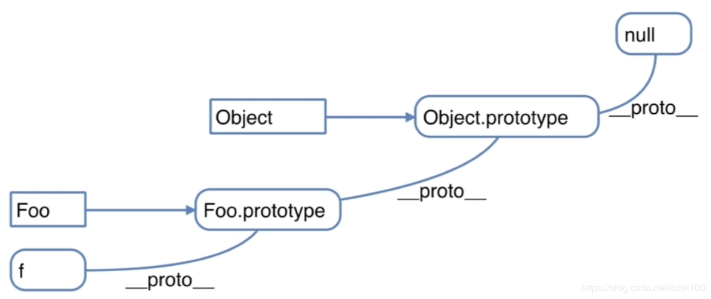
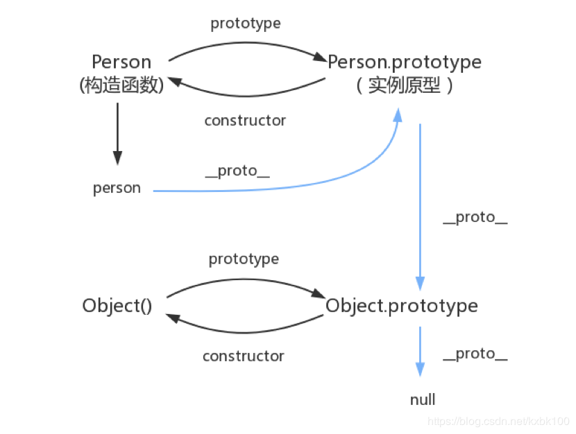
### instanceof
- 判断**引用类型**属于哪个**构造函数**的方法
- `f instanceof Foo`判断逻辑：`f`的`__proto__`一层一层往上，能否对应到`Foo.prototype`
- `f instanceof Object`判断逻辑：`f`的`__proto__`一层一层往上，是否对应到`Object.prototype`


### 循环对象自身属性
- 从上述代码中可得f拥有三个属性：name、printName、alertName
- 但我们往往希望拿到对象本身定义的属性，而不要来自其原型的属性
```js
var item;
for(item in f){
  // 高级浏览器已经在for in中屏蔽了来自原型的属性
  // 但这里建议大家加上这个判断，保证程序的健壮性以满足浏览器的兼容性
  if(f.hasOwnProperty(item)){
    console.log(item)
  }
}
```
## 题目解答
> 1. 如何准确判断一个变量是数组类型

```js
var arr = []
arr instanceof Array //true
typeof arr //object，typeof是无法判断数组的
```

> 2. 写一个原型链继承的例子
- 面试千万不要这么写
- 面试写更贴近实战的例子
```js
// 动物
function Animal() {
  this.eat = function () {
    console.log('animal eat');
  }
}
// 狗
function Dog() {
  this.bark = function () {
    console.log('dog bark');
  }
}
Dog.prototype = new Animal();
// 哈士奇
var hashiqi = new Dog();
hashiqi.eat();
hashiqi.bark();
```
```js
// 一个封装DOM查询的例子
function Elem(id) {
  this.elem = document.getElementById(id);
}

Elem.prototype.html = function (val) {
  var elem = this.elem;
  if (val) {
    elem.innerHTML = val;
    return this; // 链式操作
  } else {
    return elem.innerHTML
  }
}

Elem.prototype.on = function (type, fn) {
  var elem = this.elem;
  elem.addEventListener(type, fn);
  return this; // 链式操作
}

var div1 = new Elem('div1');
console.log(div1.html());
div1.html('<p>hello world</p>').on('click', function () {
  alert('clicked');
}).html('<p>javascript</p>')
```
> 3. 描述new一个对象的过程

- 创建一个空对象
- this指向这个新对象
- 执行代码即对this赋值
- 返回this

> 4. zepto（或其他框架）源码中如何使用原型链

- 阅读源码是最高效提高技能的方式
- 但不能“埋头苦钻”，有技巧在其中，搜索别人的阅读体会
- 慕课网搜索“zepto设计和源码分析”
- **在面试时说出读过源码并分享心得体会十分加分**
- jQuery也可
- Vue、React不建议现在读

#  三、闭包和作用域
---
> 1. 说一下变量提升的理解
> 2. 说明this几种不同的使用场景
> 3. 创建10个`<a>`标签，点击的时候弹出来对应的序号
> 4. 如何理解作用域
> 5. 实际开发中闭包的应用

## 执行上下文（声明提升）
范围：一段`<script>`或者一个函数
- 全局（某个`<script>`）：变量定义提前、函数声明提前
- 函数（函数即将执行之前）：变量定义提前、函数声明提前、确定this的值、确定arguments的值

注意：函数声明和函数表达式的区别

函数声明
```js
fn(); // 不会报错，因为函数声明会提升
function fn() {
  ... // 函数声明
}
```
函数表示式
```js
fn1(); // 会报错，fn1会被当做变量定义，会提升相当于var fn1 = undefined，在执行fn1();
// 以下均为函数表达式，函数表达式本质上即为变量定义
var a = 100;
var fn1 = function () {
  ...
}
```
假如下列代码在一个`<script>`中，在一个`<script>`中要定义一个全局的执行上下文，在执行第1行代码之前，会把所有的变量声明和函数声明都执行一遍，执行顺序如下：
- 第2行，变量定义 ，还未执行到此，所以不会赋值，把a先拿出来，用undefined代替来占位
- 第4-8行，函数声明，把整个函数拿出来，以此函数生效可以执行
- 第1行，undefined
- 第2行，a被赋值成100
- 第3行，进入函数体，函数顺利执行
- 第7行，变量定义，并用undefined代替来占位
- 第5行，age被赋值成20
- 第6行，打印arguments参数
```js
console.log(a); // undefined
var a = 100;
fn('zhangsan'); // 'zhangsan', 20
function fn(name) {
  age = 20;
  console.log(name, age);
  var age；
}
```

```js
// 全局
// var a = undefined;
console.log(a);
var a = 100;

fn('zhangsan');
function fn(name) {
  // 函数
  // 函数代码执行之前（不是函数声明之前），就已经确定了this的值
  console.log(this);
  // 函数代码执行之前（不是函数声明之前），就已经确定了arguments的值
  // arguments：函数参数的集合体
  console.log(arguments);
  age = 20;
  console.log(name, age);
  var age;

  bar(100);
  function bar(num) {
    console.log(num);
  }
}
```
## this
this要在执行时才能确定值，定义时无法确认
- 一个函数后面加`()`，即为要执行
- 在此之前，函数永远处于定义状态
```js
var a = {
  name: 'A',
  fn: function () {
    console.log(this.name);
  }
} // 只看到这里不能确认this到底是什么
a.fn(); // this === a
a.fn.call({ name: 'B' }); // this === {name: 'B'}
var fn1 = a.fn;
fn1(); // this === window
```
### 作为构造函执行
```js
function Foo(name) {
  // this = {};
  this.name = name;
  // return this;
}
var f = new Foo('zhangsan');
```
### 作为对象属性执行
```js
var obj = {
  name: 'A',
  printName: function () {
    console.log(this.name); // this === obj
  }
}
obj.printName();
```
### 作为普通函数执行
```js
function fn() {
  console.log(this); // this === window
}
fn();
```
### call apply bind
```js
function fn1(name, age) {
  alert(name);
  alert(age);
  console.log(this);  // this === window
}

// call表示{x:100}为this，'zhangsan'为第1个参数，20为第2个参数，最常用
fn1.call({ x: 100 }, 'zhangsan', 20);

// apply将后面当做数组，相当于fn1.apply({ x: 100 }, ['zhangsan', 20]);
fn1.apply({ x: 100 }, 'zhangsan', 20);

// 使用bind修改默认this，.bind必须是函数表达式
var fn2 = function (name, age) {
  alert(name);
  alert(age);
  console.log(this);
}.bind({ y: 200 })
fn2('zhangsan', 20)
```
## 作用域
- 没有**块级作用域**
- 但有**函数**和**全局作用域**
### 目的
- 封装变量
- 收敛权限
- 在函数外面不可能修改掉函数中定义的变量的值，以保证数据的安全不被污染
```js
// 没有块级作用域
if (true) {
  // 在外面定义和定义在if语句块中是一样的
  // 尽量不要在块中定义变量，容易使程序不易读
  var name = 'zhangsan';
}
console.log(name); // 'zhangsan'

// 但有函数和全局作用域
var a = 100;
function fn() {
  var a = 200;
  // 函数中也有a，则使用函数中的a = 200
  // 函数中的变量值，外面是改不了的
  // 所以框架的第三方库就采用将变量定义在函数中的方法来防止变量被污染，与外面隔绝
  console.log('fn', a);
}
console.log('global', a);// 全局 a = 100
fn();  // 函数 a = 200
```
### 作用域链
**是什么**

去父级作用域取值，根据调用回到变量定义或函数声明的地方的父作用域


**目的**

查找自由变量

**组合**

当前作用域没有定义的变量，即“自由变量”
```js
var a = 100
function fn() {
  var b = 200;
  // a即为自由变量
  console.log(a); // 去父级作用域取值，变量定义或函数声明时的父作用域
  console.log(b)
}
fn();
```
```js
var a = 100;
function F1() {
  var b = 200;
  function F2() {
    var c = 300;
    // a是自由变量
    // 父级F1中a未定义，再在F1父级中找a，a = 100
    console.log(a);
    // b是自由变量
    console.log(b);
    console.log(c);
  }
  F2();
}
F1();
```
### 闭包使用场景
函数作为返回值
```js
function F1() {
  // a是F1局部变量
  var a = 100;
  // 返回一个函数（函数作为返回值）
  return function () {
    // a是个自由变量
    console.log(a); // 去父级作用域取值，声明时的父作用域
  }
}
var f1 = F1();
// a是全局变量，不会影响到函数中定义的局部变量
var a = 200;
// 不是看此处执行时的作用域，而是回到其定义处的作用域
f1(); // 100
```
函数作为参数传递
```js
function F1() {
  // a是F1局部变量
  var a = 100;
  // 返回一个函数（函数作为返回值）
  return function () {
    // a是个自由变量
    console.log(a); // 去父级作用域取值，声明时的父作用域
  }
}
var f1 = F1();

function F2(fn) {
  var a = 200;
  fn(); // 此处为执行作用域
}

F2(f1);
```

## 题目解答
> 1. 说一下变量提升的理解

- 变量定义
- 函数声明（注意和函数表达式的区别）

> 2. 说明this几种不同的使用场景

- 构造函数
- 对象属性
- 普通函数
- call apply bind

> 3. 创建10个`<a>`标签，点击的时候弹出来对应的序号

错误写法
```js
var i, a
for (i = 0; i < 10; i++) {
  a = document.createElement('a');
  a.innerHTML = i + '<br>';
  a.addEventListener('click', function (e) {
    e.preventDefault();
    // i是自由变量，要去父作用域获取值，无块级作用域（for），即要找全局作用域
    alert(i);
  })
  document.body.appendChild(a);
}
```
正确写法
```js
var i;
for (i = 0; i < 10; i++) {
  // 自执行函数，不用调用，只要定义完成，立即执行的函数
  (function (i) {
    // 函数作用域
    var a = document.createElement('a');
    a.innerHTML = i + '<br>';
    a.addEventListener('click', function (e) {
      e.preventDefault();
      // i是自由变量，要去父作用域获取值，无块级作用域（for），即要找全局作用域
      alert(i);
    })
    document.body.appendChild(a);
  })(i)
}
```

> 4. 如何理解作用域

- 自由变量 
- 作用域链，即自由变量的查找
- 闭包的两个场景

> 5. 实际开发中闭包的应用

- 闭包实际应用主要用于封装变量，收敛权限
- 闭包的意义：你在isFirstLoad()函数外面，根本不可能修改掉_list的值，以保证数据的安全不被污染
```js
function isFirstLoad() {
  // _list表示是私有的
  var _list = [];

  return function (id) {
    if (_list.indexOf(id) >= 0) {
      return false;
    } else {
      _list.push(id);
      return true;
    }
  }
}

var firstLoad = isFirstLoad();
firstLoad(10); // true
firstLoad(10); // false
firstLoad(20); // true
firstLoad(20); // false
```
# 四、异步和单线程
---
> 1. 同步和异步的区别是什么？分别举例
> 2. 一个关于setTimeout的笔试题
> 3. 前端使用异步的场景有哪些

## 什么是异步（对比同步）
判断有没有阻塞
- 异步：无阻塞，我走我的，走完之后回来再说，等着执行，但是不卡在那儿，**等着但不闲着**
```js
console.log(100)
setTimeout(function () {
  console.log(200) // 未阻塞，没有在这儿停顿1s并打印200
}, 1000)
console.log(300)
// 100 300 200
```

- 同步：有阻塞，会阻塞下面代码的执行
```js
console.log(100)
alert(200) // 1秒后点击确认
console.log(300)
```

## 前端使用异步的场景
在可能发生等待的情况，等待过程中不能像alert一样阻塞程序运行，因此，***所有的*等待情况都需要异步**
- 定时任务：setTimeout、setInterval
- 网络请求：Ajax请求（请求Google CDN），动态``加载
```js
// Ajax请求demo
console.log('start');
$.get('./data1.json', function (data1) {
  console.log(data1);
});
console.log('end');
// start end 等待Ajax执行
```

```js
// 加载demo
console.log('start');
var img = document.createElement('img');
img.onload = function () {
  console.log('loaded');
};
img.src = '/xxx.png';
console.log('end');
// start end 等待图片加载
```
- 事件绑定
可执行多次，可以点击再点击，而前2个场景只能执行1次
```js
// 事件绑定demo
console.log('start');
document.getElementById('btn1').addEventListener('click', function () {
  alert('clicked');
});
console.log('end');
// start end 等待元素点击事件发生
```

## 异步和单线程的实现原理

### 执行顺序demo
```js
console.log(100)
setTimeout(function () {
  console.log(200)
})
console.log(300)
```
1. 执行第一行，打印100
2. 执行setTimeout后，传入setTimeout的函数会被暂存起来，不会立即执行
**单线程的特点，不能同时干两件事**
3. 执行最后一行，打印300
4. 待所有程序执行完，处于空闲状态时，会立马看有没有暂存起来的任务要执行
5. 发现暂存起来的setTimeout中的函数无需等待时间，就立即来过来执行
### 执行顺序原理
- **所有异步**中的函数都会被拿出去暂时不执行，让它们等待
1. 所有的异步都是有函数的
2. 只是暂存，并不排成队列
- 所有同步任务执行完后，要看边上有没有等待的程序在执行
- 所有异步等待的任务，**同时**判断是否满足以下条件，**不管排队或者代码书写先后**
1. 是否有等待时间
2. 发送的请求是否正确返回
3. 绑定事件是否发生
- 若有，则被封禁，等待事件发生时解禁执行异步任务
- 若无，则一直处于解禁状态，直接执行等待的异步任务
### 什么是单线程
- 单线程一次只能干一件事，只能一个一个任务排队来，不能同时执行两个任务
- JavaScript是单线程的，但是又不能让程序阻塞卡顿，所以必须异步

## 题目解答
> 1. 同步和异步的区别是什么？分别举例

- 同步会**阻塞**代码执行，而异步不会
- alert是同步，setTimeout是异步

> 2. 一个关于setTimeout的笔试题

```js
console.log(1)
setTimeout(function () {
  console.log(2)
}, 0)
console.log(3)
setTimeout(function () {
  console.log(4)
}, 1000)
console.log(5)
// 1 3 5 2 1s后打印4
```

> 3. 前端使用异步的场景有哪些
- 定时任务：setTimeout、setInverval
- 网络请求：Ajax请求、动态``加载
- 事件绑定

# 五、其它（如日期、Math、各种常用API）
---
> 1. 获取2017-06-10格式的日期
> 2. 获取随机数，要求是长度一致的字符串格式
> 3. 写一个能遍历对象和数组的通用forEach函数

## 日期
```js
// Date是个构造函数
// now是个属性，但也是个函数
// 所以Date.now()也是个函数
// 1552272178876
// 获取当前时间毫秒数
Date.now();
// Mon Mar 11 2019 10:42:17 GMT+0800 (CST)
// 会自动执行toString()，转化为字符串格式
var dt = new Date();
dt.getTime(); // 获取毫秒数
dt.getFullYear(); // 年
dt.getMonth(); // 月（0-11）从0开始的，比较特殊，需要+1
dt.getDate(); // 日（0-31）
dt.getHours(); // 小时（0-23）
dt.getMinutes(); // 分钟（0-59）
dt.getSeconds(); // 秒（0-59）
```

## Math
- 获取随机数Math.random() 
- 返回0-1之间的一个小数，位数不确定，一般很长，一般不会重复
- 常用于清除缓存

## 数组API
### forEach：遍历数组中所有元素
```js
var arr = ['a', 'b', 'c'];
arr.forEach(function(item, index) { // 值，索引
  // 遍历数组的所有元素
  // item对应"a", "b", "c"
  // index对应0, 1, 2
  console.log(index, item);
  // 0 "a"
  // 1 "b"
  // 2 "c"
})
```
### every：判断所有元素是否都符合条件
返回true或false
```js
var arr = [1, 2, 3];
var result = arr.every(function(item, index) {
  // 用来判断所有的数组元素，都满足一个条件
  if (item < 4) {
    return true;
  }
})
console.log(result); // true
```
### some：判断是否有至少一个元素符合条件
返回true或false
```js
var arr = [1, 2, 3];
var result = arr.some(function(item, index) {
  // 用来判断所有的数组元素，只要有一个满足条件即可
  if (item < 2) {
    return true;
  }
})
console.log(result); // true
```
### sort：排序
- 改变原数组
- 可对真实数据大小进行排序而不是ACSII码
```js
var arr = [1, 4, 2, 3, 5];
var arr2 = arr.sort(function(a, b) {
  // 从小到大
  return a - b;
  // 从大到小
  return b - a;
})
console.log(arr2);
```
### map：对元素重新组装
- 不改变原数组
- 生成新数组
```js
var arr = [1, 2, 3, 4];
var arr2 = arr.map(function(item, index) {
  // 将元素重新组装，并返回
  return '<b>' + item + '</b>';
})
console.log(arr2);
```
### fileter：过滤符合条件的元素
- 不改变原数组
- 返回符合条件的数组
```js
var arr = [1, 2, 3];
var arr2 = arr.filter(function(item, index) {
  // 通过某一个条件过滤数组
  if (item >= 2) {
    return true;
  }
})
console.log(arr2);
```

## 对象API
### for in：遍历对象中所有属性
```js
var obj = {
  x: 100,
  y: 200,
  z: 300
}
var key;
for (key in obj) { // key就是obj的属性名，即x, y, z
  // 注意这里的hasOwnProperty,在讲原型链时候讲过
  if (obj.hasOwnProperty(key)) {
    console.log(key, obj[key]);
  }
}
// x 100
// y 200
// z 300
```

## 题目解答
> 1. 获取2017-06-10格式的日期
```js
function formatDate(dt) {
  if (!dt) {
    dt = new Date();
  }
  var year = dt.getFullYear();
  var month = dt.getMonth() + 1;
  var date = dt.getDate();
  if (month < 10) {
    // 强制类型转换
    month = '0' + month;
  }
  if (date < 10) {
    // 强制类型转换
    date = '0' + date;
  }
  // 强制类型转换
  return year + '-' + month + '-' + date;
}
var dt = new Date();
var date = formatDate(dt);
console.log(date);
```

> 2. 获取随机数，要求是长度一致的字符串格式
```js
// 所有需要统一数字位数的情况都可以使用如下方法
var random = Math.random();
var random = random + '0000000000'; // 后面加10个零
var random = random.slice(0, 10); // 取前10位
console.log(random);
```

> 3. 写一个能遍历对象和数组的通用forEach函数
```js
function forEach(obj, fn) {
  var key;
  if (obj instanceof Array) {
    // 准确判断是不是数组
    obj.forEach(function(item, index)) {
      fn(index, item);
    }
  } else {
    // 不是数组就是对象
    for (key in obj) {
      fn(key, obj[key]);
    }
  }
}

var arr = [1, 2, 3];
// 注意，这里参数的顺序换了，为了和对象的遍历格式一致
forEach(arr, function(index, item) {
  console.log(index, item);
})
var obj = {
  x: 100,
  y: 200
}
forEach(arr, function(key, value) {
  console.log(key, value);
})
```

# 六、JS-Web-API DOM&BOM
---
> 1.	DOM是哪种基本的数据结构？
> 2.	DOM操作常用API有哪些？
> 3.	DOM节点的attr和property有何区别？
> 4. 如何检测浏览器的类型？
> 5. 拆解URL的各个部分

## 回顾JS基础知识
特点：表面看来并不能用于工作中开发代码
- 内置函数：Object、Array、Boolean、String等
- 内置对象：Math、JSON等
- 我们连在网页弹出一句hello world都不能实现

常说的JS（浏览器执行的JS）包含两部分：JS基础知识（ECMA262标准）和JS-Web-API（W3C标准）
- JS基础知识 ：ECMA262标准，只是一个规则
- JS-Web-API：W3C标准，没有规定任何JS基础相关的东西，不管什么变量类型、原型、作用域和异步，只管定义用于浏览器中JS操作页面的API和全局变量
- W3C标准中关于JS的规定有：DOM操作、BOM操作、事件绑定、Ajax请求（包括http协议）等
- NodeJS因为是基于JS所以符合ECMA262标准，但是其服务于服务器端，没有window、document等，而是有network、service等，不符合W3C标准

全面考虑，JS内置的全局函数和对象有哪些？
- 之前讲过的Object、Array、Boolean、String、Math、JSON
- 刚刚提到的window、document
- 所有未定义的全局变量，如navigator.userAgent

## DOM本质
XML是一种可扩展的描述语言，可以描述任何结构化的数据
- 数据结构：树
- HTML是XML的一种特殊类型

DOM：浏览器把拿到的HTML代码，结构化一个**浏览器能识别**并且**JS可操作**的一个模型
- Document 文档
- Object 对象
- Modal 模型

## DOM节点操作
### 获取DOM节点
[QuerySelector/QuerySelectorAll和getElementById/getElementsByClassName的区别](https://juejin.im/post/5a7d8f325188257a6c690065)
```js
// div1、divList、containerList、pList都是JS对象
var div1 = document.getElementById('div1'); // 元素
var divList = document.getElementByTagName('div'); // 集合
console.log(divList.length);
console.log(divList[0]);

var containerList = document.getElementByClassName('.container'); // 集合
var pList = document.querySelectorAll('p'); // 集合
```
### property
- 文档直接修改，查看源码即可看到修改
- 修改的是JS对象的标准属性，有关JS的属性
```js
var pList = document.querySelectorAll('p');// 集合
var p = pList[0];
console.log(p.style.width); // 获取样式
p.style.width='100px';  // 修改样式
console.log(p.className); // 获取class
p.className='p1'; // 修改class

// 获取nodeName和nodeType
console.log(p.nodeClass)
console.log(p.nodeType)
```
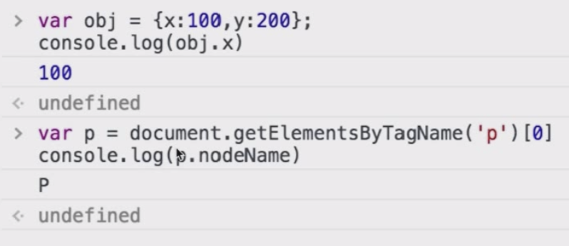
### Attribute
- 文档直接修改，查看源码即可看到修改
- 修改的是HTML代码文档内的标签，有关文档内标签的属性
- setAttribute原本没有的标签属性会自动添加
```js
var pList = document.querySelectorAll('p'); // 集合
var p = pList[0];
p.getAttribute('data-name');
p.setAttribute('data-name', 'imooc');
p.getAttribute('style');
p.setAttribute('style', 'font-size:30px;');
```
## DOM结构操作
针对树的操作
### 获取父元素
```js
var div1 = document.getElementById("div1");
var parent = div1.parentElement;
```

### 获取子元素
在使用childNodes获取子元素时，换行也会算作1个text，计为1个Node
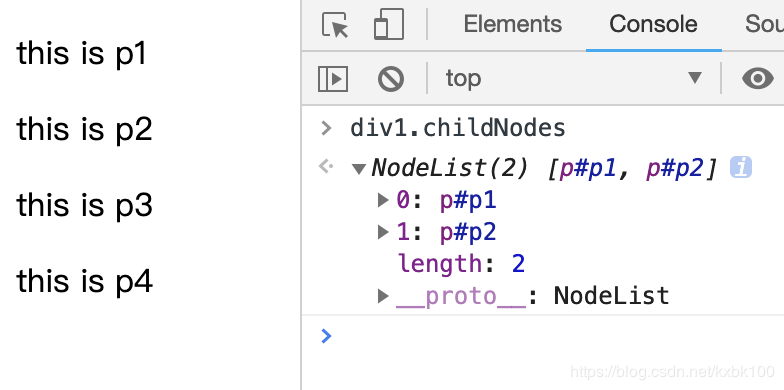
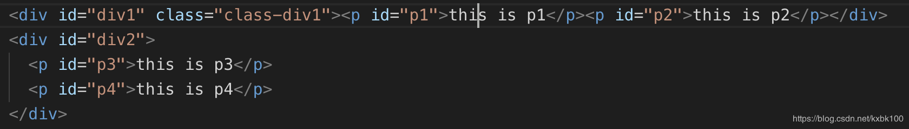
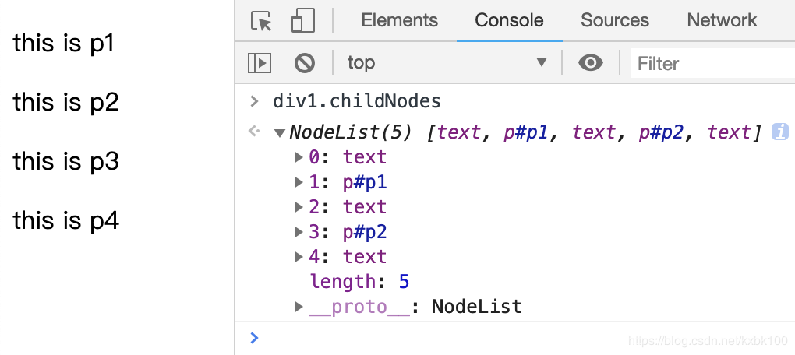
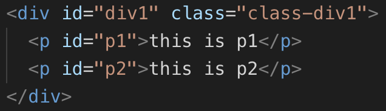
```js
var div1 = document.getElementById("div1");
var child = div1.childNodes;
console.log(child[0].nodeType) // text 3
console.log(child[1].nodeType) // p 1 标签都是1
console.log(child[0].nodeName) // text #text
console.log(child[1].nodeName) // p P
```
### 新增节点
```js
var div1 = document.getElementById('div1')
// 添加新节点
var p1 = document.createElement('p')
p1.innerHTML = 'this is p1'
div1.appendChild(p1) // 添加新创建的元素

// 移动已有节点
var p2 = document.getElementById('p2')
div1.appendChild(p2)
```
### 删除节点
```js
var div1 = document.getElementById('div1');
var child = div1.childNodes;
div1.removeChild(child[0]); // 可能看不到效果，因为删除的child[0]可能是1个因换行引起的text Node
```

## BOM
- Browser 浏览器
- Object 对象
- Model 模型
### navigator
```js
var ua = navigator.userAgent;
var isChrome = ua.indexof('Chrome');
console.log(isChrome);
```
### screen
```js
console.log(screen.width);
console.log(screen.height);
```
### location
```js
console.log(location.href); // 整个url
location.protocol; //协议：http or https
location.host; // 域名
location.pathname;  // 路径
location.search; // ?后的参数
location.hash // #后面是哈希
```
### history
```js
history.back(); // 返回
history.forward(); // 前进
```

## 题目解答
> 1.	DOM是哪种基本的数据结构？

树

> 2.	DOM操作常用API有哪些？

- 获取DOM节点以及节点的property和Attribute
- 获取父节点、子节点
- 新增节点和删除节点

> 3.	DOM节点的attr和property有何区别？

- property只是一个JS对象的属性的修改和获取
- Attribute是对HTML标签属性的修改和获取

> 4. 如何检测浏览器的类型？

```js
var ua = navigator.userAgent;
var isChrome = ua.indexof('Chrome');
console.log(isChrome);
```

> 5. 拆解URL的各个部分
```js
console.log(location.href); // 整个url
location.protocol; //协议：http or https
location.host; // 域名
location.pathname;  // 路径
location.search; // ?后的参数
location.hash // #后面是哈希
```
# 七、事件
---
> 1. 编写一个通用的事件监听函数
> 2. 描述事件冒泡过程
> 3. 对于一个无限下拉加载图片的页面，如何给每个图片绑定事件

## 通用事件绑定
关于低版本IE兼容性问题
- IE低版本使用attachEvent，和W3C标准不一样
- IE低版本使用量非常少，很多网站早已不支持
```js
var btn = document.getElementById('btn1');
btn.addEventListener('click', function (event) {
  console.log('clicked');
})
// 封装
function bindEvent(elem, type, fn) {
  elem.addEventListener(type, fn);
}
var a = document.getElementById('link1');
bindEvent(a, 'click', function (e) {
  e.preventDefault(); // 阻止默认行为，比如：阻止a标签的跳转
  alert('clicked');
})
```
## 事件冒泡
- 顺着DOM的顺序结构，底层叶节点的点击事件会一层一层根据顺序结构往其父元素上触发
- 点击p1后往上冒泡：触发p1的click事件 -> 触发div1的click事件 -> 触发body的click事件
```html
<body>
  <div id="div1">
    <p id="p1">激活</p>
    <p id="p2">取消</p>
    <p id="p3">取消</p>
    <p id="p4">取消</p>
  </div>
  
  <div id="div2">
    <p id="p5">取消</p>
    <p id="p6">取消</p>
  </div>
</body>

<script>
var p1 = document.getElementById('p1');
var body = document.body;
bindEvent(p1, 'click', function (e) {
  e.stopPropagation(); // 阻止冒泡
  alert('激活');
})

bindEvent(body, 'click', function (e) {
  alert('取消');
})
</script>
```
## 代理
**是什么**

事件冒泡的应用：通过事件冒泡机制，在元素的上层增加事件绑定机制，代理到每个元素上

**目的** 

代码简洁，减少浏览器内存占用
```html
<body>
  <div id="div1">
    <a href="#">a1</a>
    <a href="#">a2</a>
    <a href="#">a3</a>
    <a href="#">a4</a>
    <!-- 会随时新增更多a标签 -->
  </div>
</body>

<script>
  var div1 = document.getElementById('div1');
  div1.addEventListener('click', function (e) {
    var target = e.target;
    if (target.nodeName === 'A') {
      alert(target.innerHTML);
    }
  })
</script>
```
完善版本
```js
function bindEvent(elem, type, selector, fn) {
  if (fn == null) {
    fn = selector;
    selector = null;
  }
  elem.addEventListener(type, function (e) {
    var target;
    if (selector) {
      target = e.target;
      if (target.matches(selector)) {
        fn.call(target, e); // this = target
      } else {
        fn(e);
      }
    }
  })
}
```
```js
// 使用代理
bindEvent(a, 'click', 'a', function (e) {
  console.log(this.innerHTML);
})

// 不使用代理
bindEvent(a, 'click', function (e) {
  console.log(this.innerHTML);
})
```
## 题目解答
> 1. 编写一个通用的事件监听函数

> 2. 描述事件冒泡过程

DOM树形结构 -> 事件冒泡 -> 阻止冒泡 -> 冒泡的应用（代理）

> 3. 对于一个无限下拉加载图片的页面，如何给每个图片绑定事件

使用代理

# 八、Ajax & 跨域
---
> 1. 手动编写一个Ajax，不依赖第三方库
> 2. 跨域的几种实现方式

## XMLHttpRequest
- IE低版本使用ActiveXObject，和W3C标准不同
```js
var xhr = new XMLHttpRequest();
xhr.open('GET', '/app', false); // false 异步
xhr.onreadystatechange = function () {
  // 这里的函数异步执行，可参考之前JS基础中的异步模块
  if (xhr.readyState == 4) {
    if (xhr.state == 200) {
      alert(xhr.responseText)
    }
  }
}
xhr.send(null)
```
## 状态码说明
xhr.readyState == 4
| 状态码 | 状态 | 说明 |
|--|--|--|
| 0 | 未初始化 | 还没有调用send()方法 |
| 1 | 载入 | 已调用send()方法，正在发生请求 |
| 2 | 载入完成 | send()方法执行完成，已接收到全部相应内容 |
| 3 | 交互 | 正在解析相应内容 |
| 4* | 完成 | 响应内容解析完成，可以在客户端调用了 |

xhr.status == 200
| 状态码 | 说明 |
|--|--|
| 2xx | 表示成功处理请求，如200 |
| 3xx | 需要重定向，浏览器直接跳转 |
| 4xx | 客户端请求错误，如404 |
| 5xx | 服务端错误 |

## 跨域
### 什么是跨域
浏览器有同源策略，不允许Ajax访问其他域接口

跨域条件
- 协议
- 域名
- 端口（HTTP默认80；HTTPS默认443）

有一个不同就算跨域
- http://www.yourname.com/page1.html
- http://m.imooc.com/course/ajaxcourserecom?cid45

但是有三个标签允许跨域加载资源
- ``用于打点统计，统计网站可能是其他域，防盗链
- `<link href = xxx>`、`<script src = xxx>`可以使用CDN，CDN的也是其他域
- `<script src = xxx>`script可以用于JSONP

注意事项：
- 所有跨域请求都必须经过信息提供方允许
- 如果未经允许即可获取，那是浏览器同源策略出现漏洞

### JSONP
#### 实现原理
加载 http://codeing.m.imooc.com/classindex.html
- 不一定服务器端真正有一个classindex.html
- 服务器可以根据请求，动态生成一个文件，返回
- 同理于`<script src = 'http://coding.m.imooc.com/api.js'>`

例如你的网站要跨域访问慕课网的一个接口
- 慕课给你一个地址 http://coding.m.mooc.com/api.js
- 返回内容格式如`callpack({x:100, y:200})`（可动态生成）
```js
<script>
  window.callback = function (data) {
    // 这里是我们跨域得到的信息
    console.log(data)
  }
</script>
<script src="http://coding.m.imooc.com/api.js"></script>
```

#### 服务器端设置http header
跨域趋势，简洁方法，服务端设置
```js
response.setHeader('Access-Control-Allow-Origin',"http://a.com")
response.setHeader('Access-Control-Allow-Headers','X-Requestd-Width')
response.setHeader('Access-Control-Allow-Method','PUT,POST,GET,DELETE,OPTIONS')
response.setHeader('Access-Control-Allow-Credentials','true') // 接受宽裕的cookie
```

## 题目解答
> 1. 手动编写一个Ajax，不依赖第三方库

> 2. 跨域的几种实现方式

- JSONP 
- 服务器端设置http header

# 九、存储
---
> 1. 请描述下cookie、sessionStorage和localStorage的区别

## cookie
- 本身用于客户端和服务端通讯
- 但它有本地存储的功能，于是就被借用了
- 使用`document.cookie = xxx`获取修改即可

缺点
- 存储量太小，4kb
- 所有http/Ajax请求都带着，影响获取资源效率
- API简单，需要封装才能用document.cookie

## localStorage
- HTML5专门为存储而设计，最大容量5M
- API简单易用
- iOS safari隐藏模式下，`localstorage.getItem`会报错，建议统一使用try-catch封装
```js
localStorage.setItem(key, value);
localStorage.getItem(key);
```
## sessionStorage
- HTML5专门为存储而设计，最大容量5M
- API简单易用
- 浏览器关了会清零
```js
sessionStorage.setItem(key, value);
sessionStorage.getItem(key);
```

## 题目解答
> 1. 请描述下cookie、sessionStorage和localStorage的区别

- 容量
- 是否会携带到Ajax中
cookie会携带，sessionStorage和localStorage不会携带
- API易用性  


# 十、开发环境
---
## 关于开发环境
- 面试官放通过开发环境了解面试者的经验
- 开发环境最能体现工作产出效率
- 会以聊天的形式为主，而不是出具体的问题
- IDE（开发工具，写代码的效率）
- Git（代码版本管理，多人协作开发）
- JS模块化
- 打包工具
- 上线回滚的流程

## IDE
- webstorm
- sublime
- vscode
- atom
- 插件

## Git
- 正式项目都需要代码版本管理
- 大型项目需要多人协作开发
- Git和linux是一个作者
- 网络Git服务器，如 coding.net 和 github.com
- 一般公司代码非开源，都有自己的Git服务器
- 搭建Git服务器无需了解太多

Git的基本操作必须很熟练
| 命令 | 说明 |
|--|--|
| git status | 查看状态 |
| git diff | 查看两个文件的不同 |
| git checkout xxx (file name) | 发现自己改错了，需要还原 |
| git add . | 将所有修改的东西全部囊括进来 |
| git commit -m "xxx" | 修改的内容提交到本地仓库，-m代表添加的备注 |
| git push origin master | 提交到远程仓库 |
| git pull origin master | 别人修改代码，从远程下载已修改的代码 |
| git clone | 克隆新的项目 |
| git branch | 查看当前分支 |
| git checkout -b xxx | 新建一个分支 |
| git checkout xxx (branch name) | 切换到一个已有的分支 |
| git merge xxx | 合并分支 |

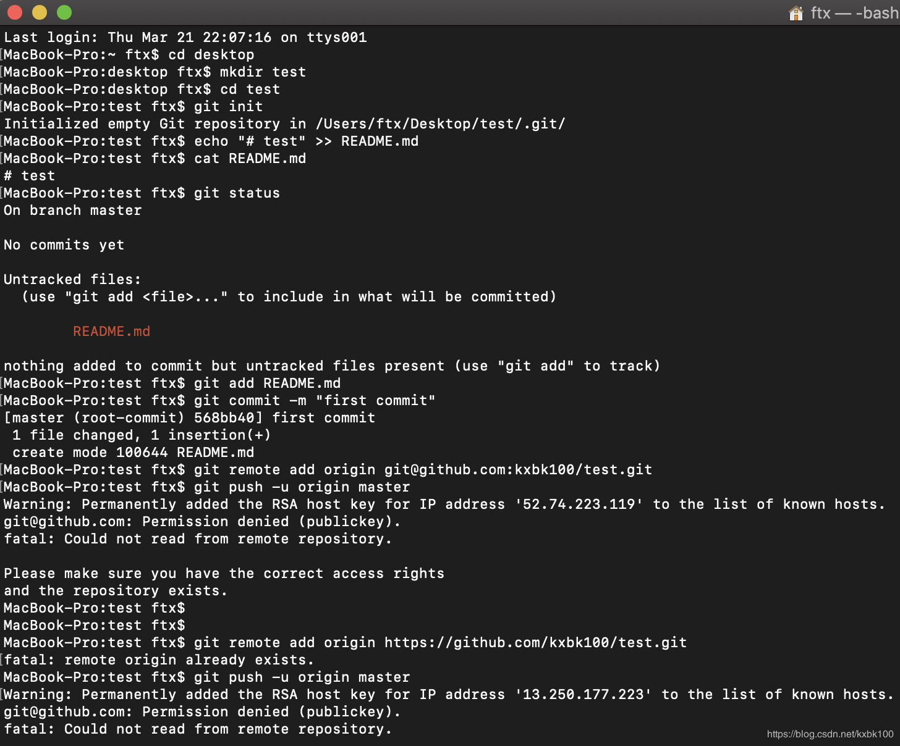

```
echo "# test" >> README.md
git init
git add README.md
git commit -m "first commit"
git remote add origin git@github.com:kxbk100/test.git
git push -u origin master
```

## 模块化
### 不使用模块化
- 依赖层级引用关系
- 代码中的函数必须是全局变量，才能暴露给使用方面，所以全局变量污染，不清楚各个文件间的依赖关系
- a.js知道要引用a-util.js，但是不知道其还需要依赖util.js

util.js
```js
function getFormatDate(date, type) {
  // type === 1 返回 2017-06-15
  // type === 2 返回 2017年6月15日
  // ...
}
```
a-util.js
```js
function aGetFormatDate(date) {
  // 要求返回 2017年6月15日 格式
  return getFormatDate(date, 2);
}
```
a.js
```js
var dt = new Date();
console.log(aGetFormatDate(dt));
```
date.html
- 顺序不能颠倒
- 3个文件之间是强依赖关系
```html
<script src="util.js"></script>
<script src="a-util.js"></script>
<script src="a.js"></script>
```

### 使用模块化
- 只往外s输出1个函数
- 在另一个文件中再接收
- 直接`<script src="a.js"></script>` ，其他的根据依赖关系自动引用
- 前2个函数，没必要做成全局变量，不会带来污染和覆盖

util.js
```js
export {
  getFormatDate: function(date, type) {
    // type === 1 返回 2017-06-15
    // type === 2 返回 2017年6月15日
    // ...
  }
}
```
a-util.js
```js
var getFormatDate = require('util.js');
export {
  aGetFormatDate: function (date) {
    // 要求返回 2017年6月15日 格式
    return getFormatDate(date, 2)
  }
}
```
a.js
```js
var aGetFormatDate = require('a-util.js');
var dt = new Date();
console.log(aGetFormatDate(dt));
```

### AMD
- 异步模块定义
- require.js
- 全局定义define函数
- 全局定义require函数
- 依赖js会自动、异步加载，不使用就不加载，提升性能
- return一个对象
- 只有先define才能被require

util.js
```js
define(function () {
  return {
    getFormateDate: function (date, type) {
      if (type == 1) {
        return '2017-06-15'
      }
      if (type == 2) {
        return '2017年6月15日'
      }
    }
  }
})
```
a-util.js
```js
define(['./util.js'], function (util) {
  return {
    aGetFormatDate: function(date) {
      return util.getFormatDate(date, 2);
    }
  }
});
```

a.js
```js
define(['./a-util.js'], function(aUtil) {
  return {
    printDate: function (date) {
      console.log(aUtil.aGetFormatDate);
    }
  }
}) 
```
main.js
```js
require(['./a.js'], function (a) {
  var date = new Date();
  a.printDate(date)
})
```
main.html
```html
<script src="/require.min.js" data-main="./main.js"></script> // 定义程序入口
```


---
a.js
```js
define(['./util.js'], function (util) {
  return {
    aGetFormateDate: function (date) {
      return util.getFormateDate();
    }
  }
})
```

main.js
```js
define(['./a.js'], function (a) {
  return {
    printDate: function (date) {
      console.log(autil.aGetFormateDate(date))
    }
  }
})
```


### CommonJS
- nodejs模块化规范，现在被大量用于前端
- 前端开发依赖的插件和库，都可以从npm中获取
- 构建工具的高度自动化，使得使用npm的成本非常低
- CommonJS不会异步加载JS，而是同步一次性加载进来
- exports输出出一个东西，var require接收一个东西

util.js
```js
module.exports = {
  getFormateDate: function (date, type) {
    if (type == 1) {
      return '2017-06-15'
    }
    if (type == 2) {
      return '2017年6月15日'
    }
  }
}
```

a-uril.js
```js
var util = require('util.js');
module.export = {
  aGetFormateDate: function (date) {
    return util.getFormateDate(date, 2);
  }
}
```

### AMD和CommonJS的使用场景
- 需要异步加载，用AMD
- 不需要异步加载JS，用CommonJS
- 使用npm之后使用CommonJS

## 构建工具(对模块化的代码打包和压缩)
构建工具
- grunt（没人用）
- gulp
- fis3
- webpack

构建的意义
- 模块化打包
- 支持CommonJS
- CommonJS受nodeJS支持
- 后端放到前端来用需要兼容
- webpack封装了很多方法，支持通过CommonJS的方式来运行在前端

安装 -> 配置 -> 处理一个简单事例 -> 得到结果
### 安装nodeJS
1. 安装Node.js
1. 进入文件目录
2. 初次使用安装http-server `sudo npm install http-server -g`
3. 使用`http-server -p 8881`生成服务
这个服务只能针对静态页面的编辑，nodejs或者php的修改无法使用

### 安装webpack
1. 进入文件目录
2. 初始化环境`npm init`
3. 自动生成package.json文件
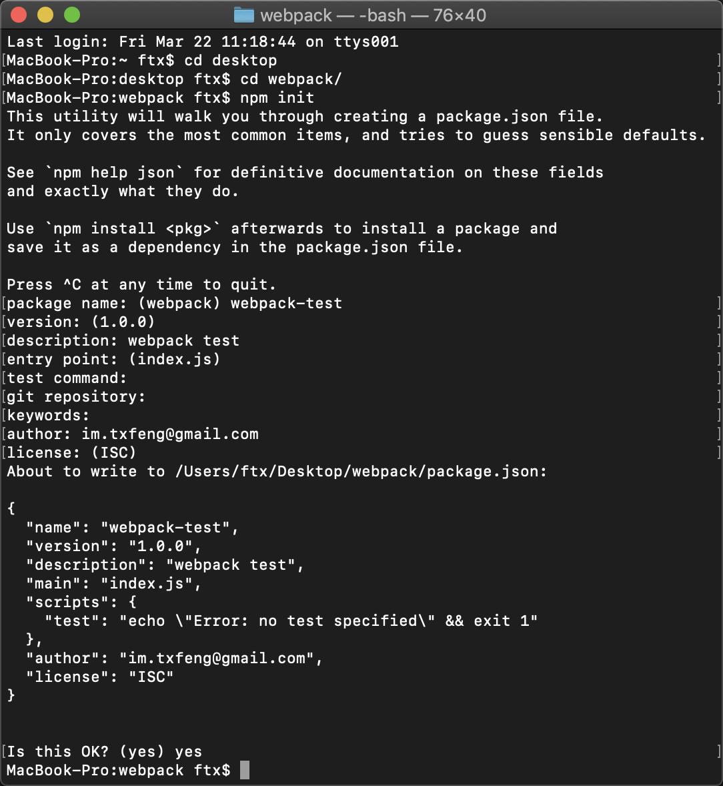
4. 安装包`npm install webpack --save-dev`，`-dev`表示仅用于开发环境
5. 安装包`npm install jquery --save`，任何环境都需要
6. 卸载包`npm uninstall moment --save`

### 配置webpack
1. 新建webpack.config.js，与index.html和package.json同级
```js
var path = require('path');
var webpack = require('webpack');

module.exports = {
  context: path.resolve(__dirname, './src'), // __dirname：前端目录
  entry: {
    app: './app.js'
  },
  output: {
    path: path.resolve(__dirname, './dist'),
    filename: 'bundle.js'
  }
}
```
2. 新建src文件夹，在其中创建app.js入口文件
3. 在package.json的script中新增
```json
"start": "webpack" // 将start指定为webpack
```
4. 在index.html中，引入bundle.js
5. 访问页面

### 使用jQuery
1. 在app.js中添加
```js
var $ = require('jquery'); // 它会从package.js中的dependencies中查找安装的juqery
```
2. 自己写模块可以根据相对路径获取
```js
var aUtil = require('./a-util.js')
```
3. `npm start`打包

###  压缩jQuery
1. 安装UglifyJS Webpack Plugin
```
$ npm install uglifyjs-webpack-plugin --save-dev
```
2. 修改webpack.config.json如下
```js
var path = require('path');
var webpack = require('webpack');
var uglifyJsPlugin = require('uglifyjs-webpack-plugin');

module.exports = {
  context: path.resolve(__dirname, './src'), // __dirname：前端目录
  entry: {
    app: './app.js'
  },
  output: {
    path: path.resolve(__dirname, './dist'),
    filename: 'bundle.js'
  },
  //压缩js
  optimization: {
    minimizer: [
      new uglifyJsPlugin({
        uglifyOptions: {
          compress: false
        }
      })
    ]
  }
}
```
3. `npm start`打包
## 上限回滚流程
### 介绍
- 是非常重要的开发环节
- 各个公司的具体流程不同
- 由专门的工具负责系统完成，我们无需关心细节
- 如果没有参与过，面试时也要说出要点
- 只讲要点，具体实现无法讲解

### 上线和回滚的基本流程
上线
- 将测试完成的代码提交到git版本库的master分支
- 将当前服务器的代码全部打包并记录版本号（1.0），备份
- 将master分支的代码提交到服务器覆盖到线上服务器，生成新版本号（1.1）

回滚
- 将当前服务器的代码打包并记录版本号（1.1），备份
- 将备份的上一个版本号解压（1.0），覆盖到线上服务器，并生成新的版本号（1.2）

### linux基本命令
- 服务器使用Linux居多，server版，只有命令行
- 测试环境要匹配线上环境，因此也是Linux
- 经常需要登录测试机来自己配置，获取数据

常用命令
- mkdir a 
- ls
- ll
- cd a
- pwd 查看路径
- rm -rf a
- vi a.js
输入：i
保存：esc :w
退出：esc :q
保存并退出：esc :wq
- cat a.js 查看文件
- cp a.js a1.js 拷贝
- mv a1.js src/a1.js
- rm a.js

# 十一、运行环境
---
> 1. 从输入url到得到html的详细过程
> 2. window.load和DOMContentLoaded的区别

## 页面加载过程
- 浏览器就可以通过访问链接来得到页面的内容
- 通过绘制和渲染，显示出页面的最终的样子

### 加载资源的形式
- 输入url或跳转页面加载html http://coding.m.imooc.com
- 加载html的静态资源`<script src="jquery.js"></script>`

### 加载一个资源的过程
1. 浏览器根据DNS服务器得到域名的IP地址
2. 向这个IP的机器发送http请求
3. 服务器收到处理并返回http请求
4. 浏览器得到返回内容

### 浏览器渲染页面的过程
1. 根据HTML结构生成DOM Tree
2. 根据CSS生成CSSOM
3. 将DOM和CSSOM整合形成Render Tree（渲染树）
4. 根据Render Tree开始渲染和展示
5. 遇到`<script>`时，会执行并阻塞渲染
因为JS会改变DOM结构及内容，所以两者不能同时进行

- 将CSS放于head中，加载完CSS后浏览器直接知道规则，在渲染body中的元素时，已将CSS考虑进去渲染
- 将CSS放于body尾部，元素先按照默认加载，然后再根据CSS进行改变，性能较差
- 将script放于body尾部，可以拿到所有DOM标签和结构，不会阻塞body上面的元素的渲染，性能较优
- `<p></p>`img DOM元素会顺序生成，但图片src异步加载

## 性能优化
### 原则
- 多使用内存、缓存或者其他方法
- 减少CPU计算、减少网络请求、减少IO操作（前端不考虑）

### 从哪里入手
#### 加载页面和静态资源
静态资源的压缩合并（打包合并+代码压缩）
- 手动合并效率低、会出错，一般用构建工具合并
- 3个文件需要发3个请求，每个请求都会耗费很多时间
- 1个文件只需发送1个请求
```html
<script src="a.js"></script>
<script src="b.js"></script>
<script src="c.js"></script>
// 打包合并后
<script src="abc.js"></script>
```

静态资源缓存
- 通过链接名称控制缓存，`<script src=“abc_1.js”></script>`
- 只有内容改变的时候，链接名称才会改变，`<script src="abc_2.js"></script>`

使用CDN
- 不同地域的资源优化
- 让资源加载更快

使用SSR后端渲染
- 现在Vue React提出了这样的概念
- 其实jsp php asp都属于后端渲染
- 数据直接输出到HTML中

#### 页面渲染
CSS放前面，js放后面

懒加载
- 图片懒加载、下拉加载更多
- 给src赋值一个很小的图
- 真正的图片放在一个data后面
- 用的时候再把data属性赋值到src中
- 加快页面渲染速度
```html

<script>
  var img1 = document.getElementById('img1');
  img1.src = img1.getAttribute('data-realsrc');
</script>
```
减少DOM操作
- 缓存DOM查询，减少DOM查询，对DOM查询做缓存
```js
// 未缓存DOM查询
var i;
for (i = 0; i < document.getElementsByTagName('p').length; i++) {
  // TODO
}

// 缓存了DOM查询
var pList = document.getElementsByTagName('p');
var i;
for (i = 0; i < pList.length; i++) {
  // TODO
}
```

- 合并DOM插入，减少DOM操作，多个操作尽量合并在一起执行
```js
var listNode = document.getElementById('list');
// 创建1个片段
var frag = document.createDocumentFragment();
var x, li;
for (x = 0; x < 10; x++) {
  li = document.createElement('li');
  li.innerHTML = "List item" + x;
  // 插入片段
  frag.appendChild(li);
}
// 最后将片段直接插入正文
listNode.appendChild(frag);
```
事件节流
- 合并频繁操作
- 很快的连着的操作，快速打字先不触发
```js
var textaarea = document.getElementById('text');
var timeoutId;
textaarea.addEventListener('keyup', function () {
  if (timeoutId) {
    clearTimeout(timeoutId);
  }
  timeoutId = setTimeout(function () {
    // 触发change事件
    console.log("用户停止打字，开始触发事件")
  }, 100);
})
```
尽早执行操作
```js
window.addEventListener('load', function () {
  // 页面全部加载完之后才会执行，包括图片、视频等
})

document.addEventListener('DOMContentLoaded', function () {
  // DOM渲染完即可执行，此时图片、视频还可能没有加载完
  // jQuery、zepto均使用此方法
})
```

## 安全性
### XSS跨站请求攻击
- 在新浪博客写一篇文章，同时偷偷插入一段`<script>`
- 攻击代码中，获取cookie，发送到自己的服务器
- 发布博客，有人查看博客内容
- 会把查看者的cookie发送到攻击者的服务器

预防
- 前端替换关键字，例如替换`<`为`&lt;`、`>`为`&gt;`（配合）
- 后端替换（建议）

### CSRF跨站请求伪造
- 你已登录一个购物网站，正在浏览器商品
- 该网站付费接口是 xxx.com/pay?id=100 ，但是没有任何验证
- 然后你收到一封邮件，隐藏着``
- 你查看邮件的时候，就已经悄悄的付费购买了

预防
- 增加验证流程，如输入指纹、密码、短信验证码等

## 面试技巧
### 简历  
- 简洁明了，重点突出项目经历和解决方案
- 把个人博客放在简历中，并且定期维护更新博客
- 把个人的开源项目放在简历中，并维护开源项目
- 简历千万不要造假，要保持能力和经历上的真实性

### 过程中
- 如何看待加班？加班就像借钱，救急不救穷
- 千万不可挑战面试官，不要反铐面试官
- 学会给面试官惊喜，但不要太多
- 遇到不会回答的问题，说出你知道的就可以
- 谈谈你的缺点：说说你最近正在学什么就可以了
> 可能对React不是很了解，最近正在学React，大约1个月后就能做出1个React的网站
 
## 题目解答
> 1. 从输入url到得到html的详细过程

- 浏览器根据DNS服务器得到域名的IP地址
- 向这个IP的机器发送http请求
- 服务器收到处理并返回http请求
- 浏览器得到返回内容

> 2. window.load和DOMContentLoaded的区别
```js
window.addEventListener('load', function () {
  // 页面全部加载完之后才会执行，包括图片、视频等
})

document.addEventListener('DOMContentLoaded', function () {
  // DOM渲染完即可执行，此时图片、视频还可能没有加载完
  // jQuery、zepto均使用此方法
})
```
-EOF-
