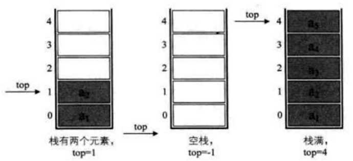

# 1 栈的概念
- 栈：限定仅在表尾进行插入和删除操作的线性表，后进先出的线性表，简称LIFO结构
- 栈顶：表尾，允许插入和删除的一端
- 栈底：表头，不允许插入和删除的一端
- 空栈：不含任何数据元素的栈

# 2 栈的顺序存储结构
## (1) 结构代码
```c
typedef int SElemType
typedef struct
{
	 SElemType data[MAXSIZE];
	 int top;
}SqStack;
```
## (2) 属性
从最底端0开始

## (3) 操作
### A 插入push：进栈
```c
int Push(SqStack *S,SElemType e)
{
	if(S->top==MAXSIZE-1){ //栈满    
		return 0;
        }
	 S->top++; //栈顶指针增加
	S->data[S->top]=e; //将新插入元素赋值给栈顶空间
	return 1;
}
```
### B 删除pop：出栈
```c
int Pop(SqStack *S,SElemType *e)
{
	 if(S->top==-1){
		return 0;
	}
	*e=S->data[S->top]; //将要删除的栈顶元素赋值给e
	S->top--; //栈顶指针减1
	return 1;
}
```
### C 进栈出栈有多种情况，只要保证是栈顶元素出栈就可以

# 3 栈的链式存储结构
## (1) 结构代码
```c
typedef struct StackNode
{
	SElemType data;
	 struct StackNode *next;
}StackNode,*LinkStackPtr;
		 
typedef struct LinkStack
{
	LinkStackPtr top;
	int count;
}LinkStack;
```
## (2) 操作
### A 插入push：进栈
```c
Status Push(LinkStack *S,SElemType e)
{
	LinkStackPtr p=(LinkStackPtr)malloc(sizeof(StackNode));
	p->data=e;
			    p->next=S->top; //把当前的栈顶元素赋值给新结点的直接后继
			    S->top=p; //将新的结点s赋值给栈顶指针
			    S->count++;
			    return OK;
}
```
		B 删除pop：出栈
			Status Pop(LinkStack *S,SElemType *e)
			{
			    LinkStackPtr p;
			    if(StackEmpty(*S)){
			        return ERROR;
			    } 
			    *e=S->top->data;
			    p=S->top; //将栈顶结点赋值给p
			    S->top=S->top->next; //使得栈顶指针下移一位，指向后一结点
			    free(p); //释放结点p
			    S->count--;
			    return OK;
			}
		C 判断栈为空
			int  empty_LinkStack(LinkStack*  top)
			{
			  if（top==null） return 1;     
			  else  return  0;        
			}
*4 两栈共享空间
	(1) 定义
		一个栈增加，一个栈缩短，当top1+top2==top2时栈满
		
	(2) 结构代码
		typedef struck
		{
		    SElemType data[MAXSIZE];
		    int top1;
		    int top2;
		}SqDoubleStack;
	(3) 操作
		A 插入push：进栈
			Status Push(SqDoubleStack *S,SElemType e,int stackNumber)
			{
			    if(S->top1+1==S->top2){ //栈已满，不能再push新元素了
			        return ERROR;
			    }
			    if(stackNumber==1){ //栈 1 有元素进栈
			        S->data[++S->top1]=e; //若是栈1则先top1+1后给数组元素赋值
			    }
			    else if(stackNumber==2){ //栈2有元素进栈
			        S->data[--S->top2]=e; //若是栈2则先top2-1后给数组元素赋值
			    }
			    return OK;
			}
		B 删除pop：出栈
			Status Pop(SqDoubleStack *S,SElemType *e,int stackNumber)
			{
			    if(stackNumber==1){
			        if(S->top1==-1){
			            return ERROR; //说明栈1已经是空栈，溢出
			        }
			        *e=S->data[S->top1--]; //将栈1的栈顶元素出栈 
			    }
			    else if(stackNumber==2){
			        if(S->top2==MAXSIZE){
			            return ERROR; //说明栈2已经是空栈，溢出
			        }
			        *e=S->data[S->top2++]; //将栈 2 的栈顶元素出栈 
			    }
			    return OK;
			}
5 栈的应用
	(1) 递归
		递归函数：一个直接调用自己或通过一系列的调用语句间接地调用自己的函数
	(2) 将中缀表达式转化为后缀表达式
		A 规则
			l 从左到右遍历中缀表达式的每个数字和符号，若是数字就输出，成为后缀表达式的一部分
			l 若是符号，则判断其与栈顶符号的优先级，乘除优先加减
			l 遇到(，将其入栈
			l 遇到)，将栈元素弹出，输出直到遇到(为止。只弹出并不输出
			l 遇到任何其他的操作符，从栈中弹出所有比待压入元素优先级高的元素直到遇到更低优先级的元素(或者栈为空)(优先级相等也要弹出)为止
			l 弹出完这些元素后，才将遇到的操作符压入到栈中。只有在遇到)的情况下我们才弹出(，其他情况我们都不会弹出(
			l 读到了输入的末尾，则将栈中所有元素依次弹出
		B 流程
			l 中缀表达式9+(3-1)×3+10÷2转化为后缀表达式9 3 1 - 3 * + 10 2 / +
			l 初始化一空栈，用来对符号进行出栈使用
			
			l 第一个字符是数字9，输出9，后面是符号+，进栈
			l 第三个字符是(，依然是符号，因其只是左括号，还未配对，故进栈
			l 第四个字符是数字3，输出，总表达式为9 3，接着是-，进栈
			
			l 接下来是数字1，输出，总表达式为9 3 1，后面是符号)，此时，我们需要去匹配此前的(，所以栈顶依次出栈，并输出，直到(出栈为止。此时左括号上方只有-，因此输出-。总的输出表达式为9 3 1 -
			l 接着是数字3，输出，总的表达式为9 3 1 - 3。紧接着是符号×，因为此时的栈顶符号为+号，优先级低于×，因此不输出，*进栈
			
			l 之后是符号+，此时当前栈顶元素比这个+的优先级高，因此栈中元素出栈并输出（没有比+更低的优先级，所以全部出栈），总输出表达式为9 3 1 - 3 * +。然后将当前这个符号+进栈。也就是说，前6张图的栈底的+是指中缀表达式中开头的9后面那个+，而图中的栈底（也是栈顶）的+是指9+(3一1)×3+中的最后一个+
			l 紧接着数字10，输出，总表达式变为9 3 1 - 3 * + 10。后是符号÷，所以/进栈
			
			l 最后一个数字2，输出，总的表达式为9 3 1 - 3 * + 10 2
			l 因已经到最后，所以将栈中符号全部出栈并输出。最终输出的后缀表达式结果为9 3 1 - 3 * + 10 2 / +
			
	(3) 将后缀表达式进行运算得出结果
		A 规则
			从左到右遍历表达式的每个数字和符号，遇到是数字就进栈，遇到是符号，就将处于栈顶两个数字出栈，进行运算，运算结果进栈，一直到最终获得结果
		B 流程
			l 计算后缀表达式9 3 1 - 3 * + 10 2 / +
			l 初始化一个空栈。此栈用来对要运算的数字进出使用
			l 后缀表达式中前三个都是数字，所以9 3 1进栈
			
			l 接下来是-，所以将栈中的1出栈作为减数，3出栈作为被减数，并运算3-1得到2，再将2进栈
			l 接着是数字3进栈
			
			l 后面是*，也就意味着栈中3和2出栈，2与3相乘，得到6，并将6进栈
			l 下面是+，所以栈中6和9出栈，9与6相加，得到15，将15进栈
			
			l 接着是10与2两数字进栈
			l 接下来是符号/，因此，栈顶的2与10出栈，10与2相除，得到5，将5进栈
			
			l 最后一个是符号+，所以15与5出栈并相加，得到20，将20进栈
			l 结果是20出栈，栈变为空
			
6 队列的概念
	l 只允许在一端进行插入操作，而在另一端进行删除操作的线性表
	l 队头：允许删除的一端
	l 队尾：允许插入的一端
	l 先进先出
	
7 队列的顺序结构
	(1) 定义
		l front指针指向队头元素，rear指针指向队尾元素的下一个位置，当front=rear时，成为空队列
		l 为了防止假溢出，我们将队列收尾相接，形成一种特殊的顺序结构——循环队列
		l 队列的最大尺寸为QueueSize
		l 队列满的条件：(rear+1)%QueueSize==front
		l 计算队列长度的公式：(rear-front+QueueSize)%QueueSize
	(2) 结构代码
		typedef int QElemType; /* QElemType 类型根据实际情况而定，这里假设为int */
		/*  循环队列的顺序存储结构 */
		typedef struct
		{
		    QElemType data[MAXSIZE];
		    int front;    /* 头指针 */
		    int rear;    /* 尾指针，若队列不空，指向队列尾元素的下一个位置 */
		} *SqQueue;
	(3) 操作
		A 初始化
			/*  初始化一个空队列 Q */
			int InitQueue(SqQueue *Q)
			{
			    Q->front=0;
			    Q->rear=0;
			    return 1;
			}
		B 求队列长度
			int QueueLength(SqQueue Q)
			{
			    return (Q.rear-Q.front+MAXSIZE)%MAXSIZE;
			}
		C 入队
			int EnQueue(SqQueue Q,QElemType e)
			{
			    if ((Q->rear+1)%MAXSIZE == Q->front){ //队列满的判断
			        return 0;
			    }
			    Q->data[Q->rear]=e; //将元素e赋值给队尾
			    Q->rear=(Q->rear+1)%MAXSIZE; //rear指针向后移一位置
			    //若到最后则转到数组头部
			    return 1;
			}
		D 出队
			int DeQueue(SqQueue Q,QElemType e)
			{
			    if (Q->front == Q->rear){ //队列空的判断
			        return 0;
			    }
			    e=Q->data[Q->front]; //将队头元素赋值给e
			    Q->front=(Q->front+1)%MAXSIZE; //front指针向后移一位置
			    //若到最后则转到数组头部
			    return 1;
			}
8 队列的链式结构
	(1) 定义
		队头指针指向链队列的头结点，队尾指针指向终端结点
		
	(2) 结构代码
		typedef int QElemType; //QElemType 类型根据实际情况而定，这里假设为int
		 
		typedef struct QNode //结点结构
		{
		    QElemType data;
		    struct QNode *next;
		}QNode,*QueuePtr;
		 
		typedef struct //队列的链表结构
		{
		    QueuePtr front,rear; //队头、队尾指针
		} *LinkQueue;
	*(3) 操作
		A 入队
			
			/*插入元素e为Q的新的队尾元素*/
			int EnQueue(LinkQueue Q,QElemType e)
			{
			    QueuePtr s=(QueuePtr)malloc(sizeof(QNode));
			    if(!s){ //存储分配失败
			        exit(-1);
			    }
			    s->data=e;
			    s->next=NULL;
			    Q->rear->next=s; //把拥有元素e的新结点s赋值给原队尾结点的后继
			    Q->rear=s; //把当前的s设置为队尾结点，rear指向s
			    return 1;
			}
		B 出队
			
			int DeQueue(LinkQueue Q,QElemType e)
			{
			    QueuePtr p;
			    if(Q->front==Q->rear){
			        return ERROR;
			    }
			    p=Q->front->next; //将欲删除的队头结点暂存给p
			    e=p->data; //将欲删除的队头结点的值赋值给e
			    Q->front->next=p->next; //将原队头结点的后继p->next赋值给头结点后继
			    if(Q->rear==p){ //若队头就是队尾，则删除后将rear指向头结点
			        Q->rear=Q->front;
			    }
			    free(p);
			    return 1;
			}
9 队列的应用
	l 汽车加油站
	l 模拟打印机缓冲区

