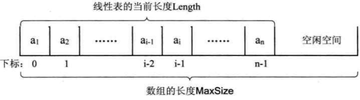
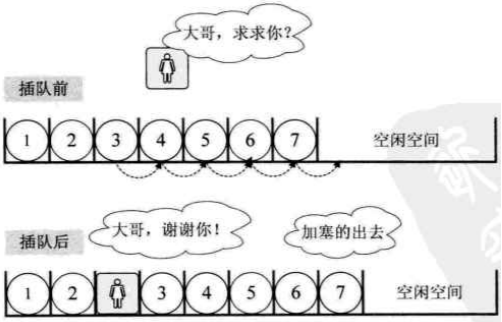
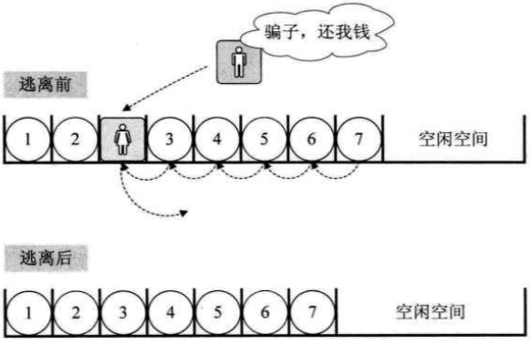
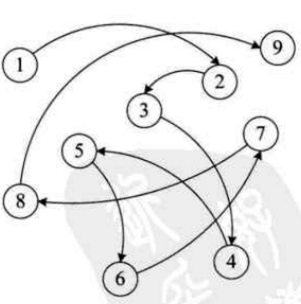
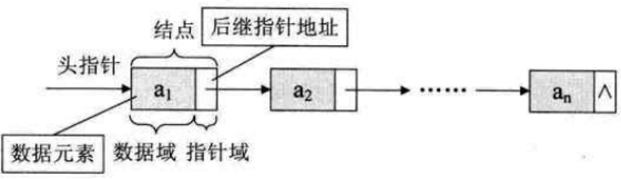
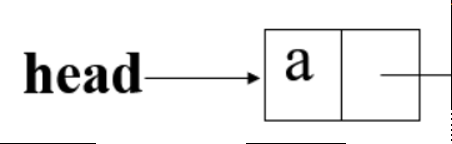
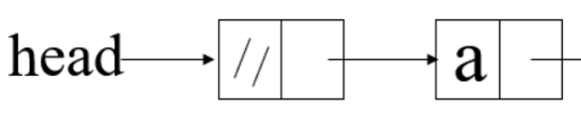
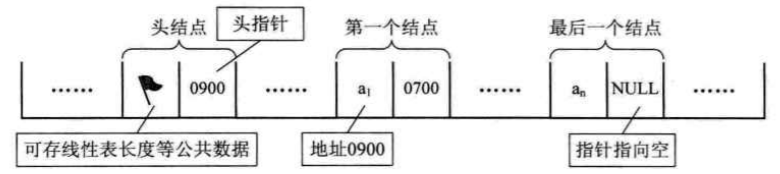
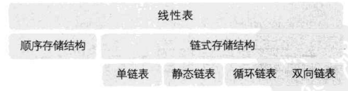

# 1 线性表的概念
## (1) 定义
零个或多个数据元素的有限序列
## (2) 属性
- 有序性：元素之间是有顺序的，若元素存在多个，则第一个元素无前驱，最后一个元素无后继，其他每个元素都有且只有一个前驱和后继
- 有限性：线性表元素的个数n（n≥0）定义为线性表的长度，当n=0时，称为空表
- 同类型

# 2 线性表的抽象数据类型
ADT 线性表(List)
```
Data
Operation
    InitList(*L) 初始化操作，建立一个空的线性表L。
    LIstEmpty(L) 若线性表为空，返回true，否则返回false。
    ClearList(*L) 将线性表清空。
    GetElem(L,i,*e) 在线性表L中的第i个位置元素值返回给e。
    LocateElem(L,e) 在线性表L中查找与给定值e相等的元素，如果查找成功，返回该元素在表中序号表示成功；否则，返回0表示失败。
    ListInsert(*L,i,*e) 在线性表L中的第i个位置插入新元素e。
    ListDelete(*L,i,*e) 删除线性表L中第i个位置元素，并用e返回其值。
    ListLength(L) 返回线性表L的元素个数。
endADT
```

# 3 线性表的顺序存储结构
## (1) 定义
- 是用一段地址连续的存储单元依次存储线性表的数据元素
- 通过占位的形式，把一定内存空间给占了，然后把相同数据类型的数据元素依次存放在这块空地中。用一维数组来实现顺序存储结构，即把第一个数据元素存到数组下标为0的位置中，接着把线性表相邻的元素存储在数组中相邻的位置
- 为了建立一个线性表，要在内存中找一块地，于是这块地的第一个位置就非常关键，它是存储空间的起始位置
## (2) 三个属性
- 存储空间的起始位置：数组data，它的存储位置就是存储空间的存储位置
- 线性表的最大存储容量：数组长度MaxSize
- 线性表的当前长度：length
**线性表的长度是线性表中数据元素的个数，在任意时刻，线性表的长度≤数组的长度**


## (3) 结构代码
```c
#define MAXSIZE 20 //存储空间初始分配量
typedef int ElemType; //ElementType类型根据实际情况而定，这里假设为int
typedef struct
{
    ElemType data[MAXSIZE]; //数组存储数据元素，最大值是MAXSIZE
    int length; //线性表当前长度
} *SqList;
```
## (4) 操作
### A 初始化顺序结构
```c
int InitList(SqList *L)  
{
    (*L)=(SqList)malloc(sizeof(SqList));
    (*L)->length=0; //空表长度为0
    return 1;  
}
```
### B 插入


```c
int ListInsert(SqList L,int i,ElemType e){
    int k;
    if(L->length==MAXSIZE){ //顺序线性表已满 
		return 0;
	}
	if(i<1 || i>L->length+1){ //当i不在范围内时
		return 0;
	}
	if(i<=L->length){//若插入数据位置不在表尾 
		for(k=L->length-1;k>=i-1;k--){ //将要插入位置后数据元素向后移动一位 
			L->data[k+1]=L->data[k];
		}
	}
	L->data[i-1]=e; //新元素插入 
	L->length++; //表长+1 
	return 1;
}
```
### C 删除


```c
int ListDelete(SqList L,int i,ElemType e){
	int k;
	if(L->length==0){ //线性表为空
	    return 0;
	}
	if(i<1 || i>L->length){ //删除位置不正确
	    return 0;
	}
	e=L->data[i-1];
	if(i<L->length){ //如果删除不是最后位置 
	    for(k=i;k<L->length;k++){ //将删除位置后继元素前移
	        L->data[k-1]=L->data[k];
	    }
	}
	L->length--; //表长-1 
	return 1;
}
```
### D 获得元素
```c
int GetElem(SqList L,int i,ElemType e){
	if(L->length==0 || i<1 || i>L->length){
	    return 0;
	}
	e=L->data[i-1];
	return 1;
}
```
### E 打印元素
```c
int ListTraverse(SqList L)
{  
	 int i;  
	 for(i=1;i<=L->length;i++){  
		 printf("位置：%d，元素：%d\n",i,L->data[i-1]);
	}  
	return 1;  
}
```
### (5) 实例
```c
#include <stdio.h>
#include <stdlib.h>
 
#define MAXSIZE 20 //存储空间初始分配量
typedef int ElemType; //ElementType类型根据实际情况而定，这里假设为int
typedef struct
{
    ElemType data[MAXSIZE]; //数组存储数据元素，最大值是MAXSIZE
    int length; //线性表当前长度
} *SqList;
 
	/*初始化顺序结构*/ 
	int InitList(SqList *L)  
	{
	    (*L)=(SqList)malloc(sizeof(SqList));
	    (*L)->length=0; //空表长度为0
	    return 1;  
	}
	 
	/*插入元素*/
	int ListInsert(SqList L,int i,ElemType e){
	    int k;
	    if(L->length==MAXSIZE){ //顺序线性表已满 
	        return 0;
	    }
	    if(i<1 || i>L->length+1){ //当i不在范围内时
	        return 0;
	    }
	    if(i<=L->length){//若插入数据位置不在表尾 
	        for(k=L->length-1;k>=i-1;k--){ //将要插入位置后数据元素向后移动一位
	            L->data[k+1]=L->data[k];
	        }
	    }
	    L->data[i-1]=e; //新元素插入 
	    L->length++; //表长+1 
	    return 1;
	}
	 
	/*删除元素*/ 
	int ListDelete(SqList L,int i){
	    int k;
	    if(L->length==0){ //线性表为空
	        return 0;
	    }
	    if(i<1 || i>L->length){ //删除位置不正确
	        return 0;
	    }
	    if(i<L->length){ //如果删除不是最后位置 
	        for(k=i;k<L->length;k++){ //将删除位置后继元素前移
	            L->data[k-1]=L->data[k];
	        }
	    }
	    L->length--; //表长-1 
	    return 1;
	}
	 
	/*获得元素*/
	int GetElem(SqList L,int i){
	    if(L->length==0 || i<1 || i>L->length){
	        return 0;
	    }
	    printf("%d\n",L->data[i-1]);
	    return 1;
	}
 
/*打印顺序结构*/
int ListTraverse(SqList L)
{  
    int i,len;  
    len=L->length;  
    for(i=1;i<=len;i++){  
        printf("位置：%d，元素：%d\n",i,L->data[i-1]);
    }  
    return 1;  
}  
 
int main(void)
{
    SqList L;
    InitList(&L);
    ListInsert(L,1,1);
    ListInsert(L,2,2);
    ListTraverse(L);
    GetElem(L,2);
    ListDelete(L,2);
    ListTraverse(L);
    return 0;
}
```

# 4 线性表的链式存储结构
## (1) 定义



### A 头指针
- 头指针是指链表指向第一个结点的指针，若链表有头结点，则是指向头结点的指针
- 无论链表是否为空，头指针均不为空
- 头指针是链表的必要元素

### B 头结点
- 头结点是为了操作的统一和方便而设立的，放在第一元素的结点之前，其数据域一般无意义（也可存放链表的长度）
- 有了头结点，对在第一元素结点前插入结点和删除第一结点，其操作与其它结点的操作就统一了
- 头结点不一定是链表必须要素
- 无头结点访问`a：head`

- 有头结点访问`a：head -> next



## (2) 结构代码
```
typedef int ElemType;
typedef struct Node{
	ElemType data;
	struct Node *next;
} Node;
typedef struct Node *LinkList;
```
## (3) 操作
### A 初始化链式结构
```c
int InitList(LinkList *L)
{
    (*L)=(LinkList)malloc(sizeof(Node));
    (*L)->next=NULL;
    return 1;
}
```
### B 插入
```c
int ListInsert(LinkList L,int i,ElemType e)
{
    int j = 1;
    LinkList p,s;
    p=L;
   while (p && j<i){ //寻找第i结点
        p=p->next;
        ++j;
    }
    if(!p || j>i){
        return 0; //第i个元素不存在
    }
    s=(LinkList)malloc(sizeof(Node)); //生成新结点(C语言标准函数)
    s->data=e; //结构体即scanf
    s->next=p->next; //将p的后继结点赋值给s的后继
    p->next=s; //将s赋值给p的后继
    return 1;
}

```
### C 删除
```c
int ListDelete(LinkList L,int i,ElemType e)
{
    int j = 1;
    LinkList p,q;
    p=L;
     while(p->next && j<i){ //历寻找第i个元素
        p=p->next;
        ++j;
    }
    if (!(p->next) || j>i){
        return 0; //第i个元素不存在
    }
    q=p->next;
    p->next=q->next; //将q的后继赋值给p的后继
    e=q->data; //将q结点中的数据给e
    free(q); //让系统回收此结点，释放内存
    return 1;
}

```
### D 获得元素
第一部分遍历查找第i个结点；第二部分插入和删除结点
```c
int GetElem(LinkList L,int i,ElemType e){
	int j = 2; //j为计数器 
	LinkList p; //声明一结点p
	p=L->next; //让p指向链表L的第一个结点 
	while(p && j<i){ //p不为空或者计数器j还没有等于i时，循环继续 
	    p=p->next; //让p指向下一个结点 
	    ++j;
	}
	if(!p || j>i){
	    return 0; //第i个元素不存在 
	}
	e=p->data; //取第i个元素的数据 
	return 1;
}
```
### E 整表删除
```c
int ClearList(LinkList L)
{
    LinkList p,q;
    p=L->next; //p指向第一个结点
    while(p){ //没到表尾
        q=p->next;
        free(p);
        p=q;
    }
    L->next=NULL; //头结点指针域为空
    return 1;
}
```		
### F 打印元素
只有初始化的时候函数是带*的
```c
int ListTraverse(LinkList L){
	LinkList e;
	e=L;
	if(e->next==NULL){
	    return 0;
	} else{
	    while(e->next!=NULL){
	        printf("%d",e->next->data);
	        e=e->next;
	     }
	    return 1;
	}    
}
 ```

## (4) 实例
```c
#include <stdio.h>
#include <stdlib.h>   
#include <string.h>
  
/*定义元素类型*/
typedef struct{
    char name[20];
    char press[20];
    char writer[20];
    char date[15];
    double money;
}Book;
 
typedef Book ElemType;
 
/*定义链表结构*/
typedef struct Node{
    ElemType data;
    struct Node *next;
} Node;
 
typedef struct Node *LinkList;
 
/*初始化链表*/
int InitList(LinkList *L)
{
    *L=(LinkList)malloc(sizeof(Node));
    (*L)->next=NULL;
    return 1;
}
 
/*借书*/
int ListDelete(LinkList L,char find[])
{
    int j;
    LinkList p,q;
    p=L;
    j=1;
    int a=0;
    if(p->next==NULL){
        printf("\n对不起，图书馆暂无图书，请先添加！\n");
        return 0;
    }
    else{
        while(p!=NULL){
            if(strcmp(p->next->data.name,find)==0){
                q=p->next;
                p->next=q->next;
                free(q);
                printf("\n删除%s成功!\n",find);
                a=1;
                break;
            }
            p=p->next;
        } 
    }
    if(a==0) printf("\n输入的书名有误，删除失败！\n");
}
 
/*添书、还书*/
int ListInsert(LinkList L,int i)
{
    int j;
    LinkList p,s;
    p=L;
    j=1;
    while (p && j<i){ //寻找第i结点
        p=p->next;
        ++j;
    }
    if(!p || j>i){
        return 0; //第i个元素不存在
    }
    s=(LinkList)malloc(sizeof(Node)); //生成新结点(C语言标准函数)
    printf("\n请输入书名："); 
    scanf("%s",s->data.name);
    printf("\n请输入作者：");
    scanf("%s",s->data.writer);
    printf("\n请输入出版社：");
    scanf("%s",s->data.press);
    printf("\n请输入日期：");
    scanf("%s",s->data.date);
    printf("\n请输入价格：");
    scanf("%lf",&s->data.money);
    s->next=p->next; //将p的后继结点赋值给s的后继
    p->next=s; //将s赋值给p的后继
    return 1;
}
 
/*查书*/
int findbook(LinkList L){
    LinkList e;
    int key;
    int sign=0;
    char find[20];
    e=L;
    printf("\n请选择你要查询的关键词种类：1、书名    2、作者    3、出版社    4、日期\n");
    scanf("%d",&key);
    switch(key){
        case 1:    
            printf("\n请输入您要查询的书名：");
            scanf("%s",find);
            while(e->next!=NULL){
                if(strcmp(e->next->data.name,find)==0){
                    printf("\n符合条件书的信息：\n书名：%s    作者：%s    出版社：%s    日期：%s    价格：%.2lf\n",e->next->data.name,e->next->data.writer,e->next->data.press,e->next->data.date,e->next->data.money);
                    sign=1;    
                }
                e=e->next;    
            }
            break;
        case 2:    
            printf("请输入您要查询的作者：");
            scanf("%s",find);
            while(e->next!=NULL){
                if(strcmp(e->next->data.writer,find)==0){
                    printf("\n符合条件书的信息：\n书名：%s    作者：%s    出版社：%s    日期：%s    价格：%.2lf\n",e->next->data.name,e->next->data.writer,e->next->data.press,e->next->data.date,e->next->data.money);
                    sign=1;
                }
                e=e->next;    
            }
            break;
        case 3:    
            printf("\n请输入您要查询的出版社：");
            scanf("%s",find);
            while(e->next!=NULL){
                if(strcmp(e->next->data.press,find)==0){
                    printf("\n符合条件书的信息：\n书名：%s    作者：%s    出版社：%s    日期：%s    价格：%.2lf\n",e->next->data.name,e->next->data.writer,e->next->data.press,e->next->data.date,e->next->data.money);
                }
                e=e->next;    
            }
            break;
        case 4:    
            printf("\n请输入您要查询的类日期：");
            scanf("%s",find);
            while(e->next!=NULL){
                if(strcmp(e->next->data.date,find)==0){
                    printf("\n符合条件书的信息：\n书名：%s    作者：%s    出版社：%s    日期：%s    价格：%.2lf\n",e->next->data.name,e->next->data.writer,e->next->data.press,e->next->data.date,e->next->data.money);
                    sign=1;
                }
                e=e->next;    
            }
            break;
    }
    return sign;
}
 
/*显示*/ 
int ListTraverse(LinkList L){
    LinkList e;
    int i=1;
    e=L;
    if(e->next==NULL){
        return 0;
    }
    else{
        while(e->next!=NULL){
            printf("\n第%d本书的信息：\n书名：%s\t\t作者：%s\t\t出版社：%s\t\t日期：%s\t\t价格：%.2lf\n\n",i,e->next->data.name,e->next->data.writer,e->next->data.press,e->next->data.date,e->next->data.money);
            e=e->next;
            i++;
        }
        return 1;
    }    
}
 
int main(void)
{  
    /*构造线性表 */
    LinkList books;
    InitList(&books);
    int n,insert,loc,sign;
    char key[20];
    do{
        printf("\n--------------------------------ZUST图书管理系统欢迎您-----------------------------------\n"); 
        printf("\n请选择功能：\n\n0、添加图书\t1、查询图书\t2、删除图书\t3、所有图书\t4、退出\n\n请输入您要进行的操作：");
        scanf("%d",&n);
        printf("\n-----------------------------------------------------------------------------------------\n"); 
        switch(n){
            case 0: 
                printf("\n请输入您要添加书的位置:");
                scanf("%d",&loc);
                insert=ListInsert(books,loc);
                if(insert==0) printf("\n位置输入有误，添加失败！\n");
                break;
            case 1: 
                sign=findbook(books);
                if(sign==0) printf("\n对不起，图书馆暂无此书！\n"); 
                break;
            case 2:
                printf("\n请输入您要删除的图书书名：");
                scanf("%s",key);
                ListDelete(books,key);
                break;
            case 3
            : 
                ListTraverse(books);
                break;
        }
    }while(n!=4);
    printf("\n图书管理系统已退出！\n"); 
    return 0;
}

```

# 5 循环链表
## (1) 定义
- 将单链表中终端结点的指针端由空指针改为指向头结点，就使整个单链表形成一个环，行成头尾相接的单链表
- 其实循环链表和单链表的主要差异就在于循环的判断条件上，原来是判断`p->next`是否为空，现在则是`p->next`不等于头结点，则循环未结束
## (2) 双向链表
### A 结构代码
```c
typedef struct DulNode
{
    ElemType data;
    struct DulNode *prior;
    struct DulNode *next;    
} DulNode,*DuLinkList;
 ```
### *B 操作
#### 插入
```c
s->prior=p; //S的前驱
s->next=p->next; //S的后继
p->next=prior=s; //后结点的前驱
p->next=s; //后结点的后继
```

#### 删除
```c
p->prior->next=p->next; //前结点的后继
p->next->prior=p->prior; //后结点的前驱
free(p);
```
				
# 6 单链表结构与顺序存储结构优缺点
- 顺序存储结构：频繁查找，很少插入和删除；知道线性表的大致长度
- 单链表结构：频繁插入和删除，很少查找；当元素个数变化较大或者根本不知道有多大

# 7 线性表的关系



