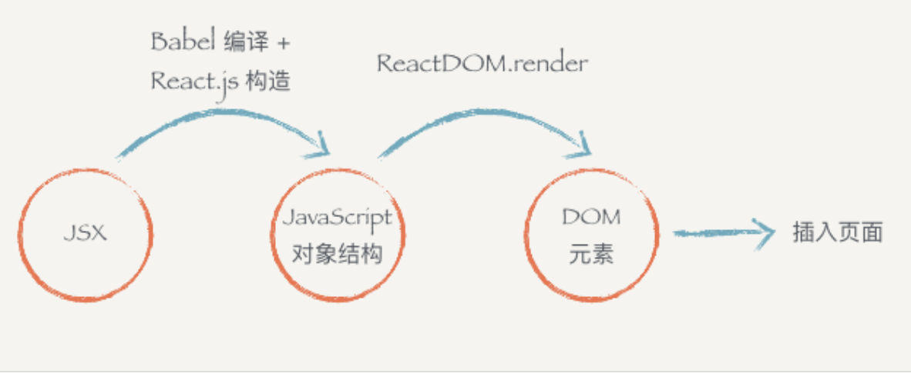
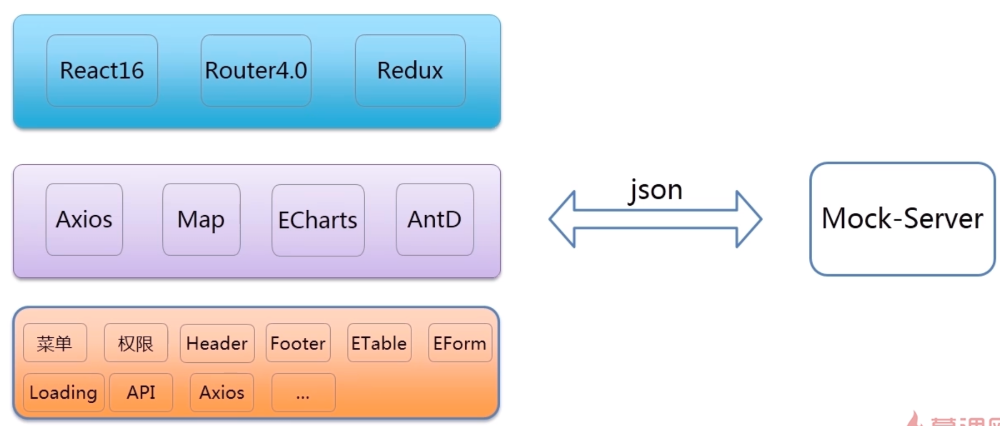
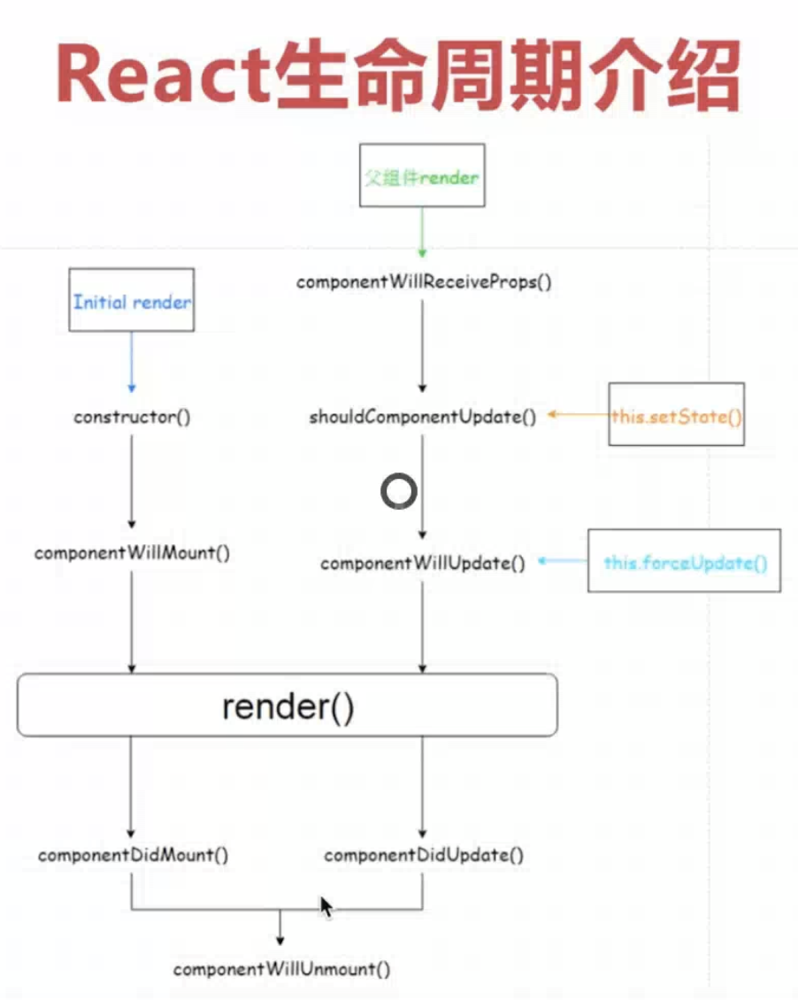

# React文档

## 入门

- React 是一个声明式，高效且灵活的用于构建用户界面的 JavaScript 库
- 使用 React 可以将一些简短、独立的代码片段组合成复杂的 UI 界面，这些代码片段被称作“组件”
- 创建React项目，`npx create-react-app my-app`
- ShoppingList 是一个 **React 组件类**，或者说是一个 **React 组件类型**
- 一个组件接收一些参数，我们把这些参数叫做 `props`
- 然后通过 `render` 方法返回需要展示在屏幕上的视图的层次结构，`render` 方法的返回值描述了你希望在屏幕上看到的内容
- 在 JSX 中你可以任意使用 JavaScript 表达式，只需要用一个大括号把表达式括起来
- 在 React 中，有一个命名规范，通常会将代表事件的监听 prop 命名为 `on[Event]`，将处理事件的监听方法命名为 `handle[Event]` 这样的格式。

## 创建新的 React 应用

```shell
npx create-react-app my-app
cd my-app
yarn start

// 构建
yarn build
```

## JSX 简介

- 在 React 中配合使用 JSX，JSX 可以很好地描述 UI 应该呈现出它应有交互的本质形式
- JSX 里的 `class` 变成了 `className`，而 `tabindex` 则变为 `tabIndex`
- 在 JSX 语法中，你可以在大括号内放置任何有效的JavaScript 表达式
- 建议将内容包裹在括号中，这样可以避免遇到自动插入分号陷阱
- Babel 会把 JSX 转译成一个名为 `React.createElement()` 函数调用

## 元素渲染

与浏览器的 DOM 元素不同，React 元素是创建开销极小的普通对象，React DOM 会负责更新 DOM 来与 React 元素保持一致

### 将一个元素渲染为 DOM

想要将一个 React 元素渲染到根 DOM 节点中，只需把它们一起传入 `ReactDOM.render()`

```react
const element = <h1>Hello, world</h1>;
ReactDOM.render(element, document.getElementById('root'));
```

### 更新已渲染的元素

- React 元素是[不可变对象](https://en.wikipedia.org/wiki/Immutable_object)。一旦被创建，你就无法更改它的子元素或者属性
- 一个元素就像电影的单帧：它代表了某个特定时刻的 UI。
- 更新 UI 唯一的方式是创建一个全新的元素，并将其传入 `ReactDOM.render()`

### React 只更新它需要更新的部分

React DOM 会将元素和它的子元素与它们之前的状态进行比较，并只会进行必要的更新来使 DOM 达到预期的状态

## 组件 & Props

### 函数组件与 class 组件

- 组件允许你将 UI 拆分为独立可复用的代码片段，并对每个片段进行独立构思
- 组件，从概念上类似于 JavaScript 函数。它接受任意的入参（即 “props”），并返回用于描述页面展示内容的 React 元素

函数组件

```react
function Welcome(props) {
  return (
    <h1>Hello, {props.name}</h1>;
  )
}
```

class组件

```react
class Welcome extends React.Component {
  render() {
    return (
      <h1>Hello, {this.props.name}</h1>;
    )
  }
}
```

上述两个组件在 React 里是等效的

### 渲染组件

```react
function Welcome(props) {
  return <h1>Hello, {props.name}</h1>;
}

const element = <Welcome name="Sara" />;
ReactDOM.render(
  element,
  document.getElementById('root')
);
```

- React 元素也可以是用户自定义的组件
- 组件名称必须以大写字母开头

### Props 的只读性

**所有 React 组件都必须像纯函数一样保护它们的 props 不被更改**

## State & 生命周期

### State

State 与 props 类似，但是 state 是私有的，并且完全受控于当前组件。

### 将函数组件转换成 class 组件

1. 创建一个同名的 [ES6 class](https://developer.mozilla.org/en/docs/Web/JavaScript/Reference/Classes)，并且继承于 `React.Component`。
2. 添加一个空的 `render()` 方法。
3. 将函数体移动到 `render()` 方法之中。
4. 在 `render()` 方法中使用 `this.props` 替换 `props`。
5. 删除剩余的空函数声明。

### 向 class 组件中添加局部的 state

1. 把 `render()` 方法中的 `this.props.date` 替换成 `this.state.date` 
2. 添加一个 [class 构造函数](https://developer.mozilla.org/en/docs/Web/JavaScript/Reference/Classes#Constructor)，然后在该函数中为 `this.state` 赋初值，Class 组件应该始终使用 `props` 参数来调用父类的构造函数
3. 移除 `<Clock />` 元素中的 `date` 属性

### 将生命周期方法添加到 Class 中

- 当 `Clock` 组件第一次被渲染到 DOM 中的时候，就为其[设置一个计时器](https://developer.mozilla.org/en-US/docs/Web/API/WindowTimers/setInterval)。这在 React 中被称为“挂载（mount）”
- 当 DOM 中 `Clock` 组件被删除的时候，应该[清除计时器](https://developer.mozilla.org/en-US/docs/Web/API/WindowTimers/clearInterval)。这在 React 中被称为“卸载（umount）”。

```react
import React from 'react';
import ReactDOM from 'react-dom';


class Clock extends React.Component {
  constructor(props) {
    super(props);
    this.state = { date: new Date() };
  }

  componentDidMount() {
    this.timerID = setInterval(
      () => this.tick(),
      1000
    )
  }

  componentWillMount() {
    clearInterval(this.timerID);
  }

  tick() {
    this.setState({
      date: new Date()
    });
  }

  render() {
    return (
      <div>
        <h1>Hello, world!</h1>
        <h2>It is {this.state.date.toLocaleTimeString()}.</h2>
      </div>
    );
  }
}

ReactDOM.render(
  <Clock />,
  document.getElementById('root')
);
```

1. 当 `<Clock />` 被传给 `ReactDOM.render()`的时候，React 会调用 `Clock` 组件的**构造函数**。 因为 `Clock` 需要显示当前的时间，所以它会用一个包含当前时间的对象来初始化 `this.state`。我们会在之后更新 state。
2. 之后 React 会调用组件的 `render()` 方法。这就是　React 确定该在页面上展示什么的方式。然后　React 更新 DOM 来匹配 `Clock` 渲染的输出。
3. 当 `Clock` 的输出被插入到 DOM 中后， React 就会调用 `ComponentDidMount()` 生命周期方法。在这个方法中，`Clock` 组件向浏览器请求设置一个计时器来每秒调用一次组件的 `tick()`方法。
4. 浏览器每秒都会调用一次 `tick()` 方法。 在这方法之中，`Clock` 组件会通过调用 `setState()` 来计划进行一次 UI 更新。得益于 `setState()` 的调用，React 能够知道 state 已经改变了，然后会重新调用 `render()` 方法来确定页面上该显示什么。这一次，`render()` 方法中的 `this.state.date` 就不一样了，如此以来就会渲染输出更新过的时间。React 也会相应的更新 DOM。
5. 一旦 `Clock` 组件从 DOM 中被移除，React 就会调用 `componentWillUnmount()` 生命周期方法，这样计时器就停止了。

### 正确地使用 State

1. 不要直接修改 State，构造函数是唯一可以给`this.state`赋值的地方

```react
// Wrong
this.state.comment = 'Hello';

// Correct
this.setState({comment: 'Hello'});
```

2. State的更新可能是异步的，因为 `this.props` 和 `this.state` 可能会异步更新，所以你不要依赖他们的值来更新下一个状态
3. State 的更新会被合并，可以分别调用 `setState()` 来单独地更新它们

### 数据是向下流动的

如果你把一个以组件构成的树想象成一个 props 的数据瀑布的话，那么每一个组件的 state 就像是在任意一点上给瀑布增加额外的水源，但是它只能向下流动。

## 事件处理

- React 事件的命名采用小驼峰式（camelCase），而不是纯小写
- 使用 JSX 语法时你需要传入一个函数作为事件处理函数，而不是一个字符串
- 在 React 中另一个不同点是你不能通过返回 `false` 的方式阻止默认行为。你必须显式的使用 `preventDefault` 
- 为了在回调中使用 `this`，在constructor中 这个绑定是必不可少的 `this.handleClick = this.handleClick.bind(this);`

```react
// 无参数
<button onClick={activateLasers}>
  Activate Lasers
</button>

// 有参数
<button onClick={this.deleteRow.bind(this, id)}>Delete Row</button>
```

## 条件渲染

- 可以使用变量来储存元素。 它可以帮助你有条件地渲染组件的一部分，而其他的渲染部分并不会因此而改变
- 在JSX中调用变量使用{XXX}
- 使用 JavaScript 运算符`if`或者条件运算符去创建元素来表现当前的状态，然后让 React 根据它们来更新 UI
- class组件if、let、const等只能写在Render() {...}中
- 组织组件渲染return null;

## 列表 & Key

```react
const numbers = [1, 2, 3, 4, 5];
const listItems = numbers.map((number) =>
  <li>{number}</li>
);

ReactDOM.render(
  <ul>{listItems}</ul>,
  document.getElementById('root')
);
```

```react
function NumberList(props) {
  const numbers = props.numbers;
  const listItems = numbers.map((number) =>
    <li key={number.toString()}>
      {number}
    </li>
  );
  return (
    <ul>{listItems}</ul>
  );
}

const numbers = [1, 2, 3, 4, 5];
ReactDOM.render(
  <NumberList numbers={numbers} />,
  document.getElementById('root')
);
```

### key

- key 帮助 React 识别哪些元素改变了，比如被添加或删除。因此你应当给数组中的每一个元素赋予一个确定的标识

```react
const numbers = [1, 2, 3, 4, 5];
const listItems = numbers.map((number) =>
  // 一定要toString()
  <li key={number.toString()}>
    {number}
  </li>
);
```

- 一个元素的 key 最好是这个元素在列表中拥有的一个独一无二的字符串。通常，我们使用来自数据 id 来作为元素的 key

```react
const todoItems = todos.map((todo) =>
  <li key={todo.id}>
    {todo.text}
  </li>
);
```

- 当元素没有确定 id 的时候，万不得已你可以使用元素索引 index 作为 key

```react
const todoItems = todos.map((todo, index) =>
  // Only do this if items have no stable IDs
  <li key={index}>
    {todo.text}
  </li>
);
```

- 记忆：在 `map()` 方法中的元素需要设置 key 属性。

```react
function ListItem(props) {
  // 正确！这里不需要指定 key：
  return <li>{props.value}</li>;
}

function NumberList(props) {
  const numbers = props.numbers;
  const listItems = numbers.map((number) =>
    // 正确！key 应该在数组的上下文中被指定
    <ListItem key={number.toString()} value={number} />
  );
  return (
    <ul>
      {listItems}
    </ul>
  );
}

const numbers = [1, 2, 3, 4, 5];
ReactDOM.render(
  <NumberList numbers={numbers} />,
  document.getElementById('root')
);
```

- key 只是在兄弟节点之间必须唯一，当我们生成两个不同的数组时，我们可以使用相同的 key 值
- key 会传递信息给 React ，但不会传递给你的组件，所以 组件可以读出 `props.id`，但是不能读出 `props.key`
- JSX 允许在大括号中嵌入任何表达式
- 如果一个 `map()` 嵌套了太多层级，那可能就是你提取组件的一个好时机

## 表单

### input/textarea

- 在 React 中，`<textarea>` 使用 `value` 属性代替文本内容，这样使用 `<textarea>` 的表单和使用单行 input 的表单非常类似

```react
class NameForm extends React.Component {
  constructor(props) {
    super(props);
    this.state = {value: ''};

    this.handleChange = this.handleChange.bind(this);
    this.handleSubmit = this.handleSubmit.bind(this);
  }

  handleChange(event) {
    this.setState({value: event.target.value});
  }

  handleSubmit(event) {
    alert('提交的名字: ' + this.state.value);
    // 注意！！！
    event.preventDefault();
  }

  render() {
    return (
      <form onSubmit={this.handleSubmit}>
        <label>
          名字:
          <input type="text" value={this.state.value} onChange={this.handleChange} />
        </label>
        <input type="submit" value="提交" />
      </form>
    );
  }
}
```

### select

- React 并不会使用 `selected` 属性，而是在根 `select` 标签上使用 `value` 属性。这在受控组件中更便捷，因为您只需要在根标签中更新它
-  `<input type="text">`, `<textarea>` 和 `<select>` 之类的标签都非常相似—它们都接受一个 `value` 属性
- 可以将数组传递到 `value` 属性中，以支持在 `select` 标签中选择多个选项

```react
<select multiple={true} value={['B', 'C']}>
```

### 文件 input 标签

因为它的 value 只读，所以它是 React 中的一个**非受控**组件

```react
<input type="file" />
```

### 处理多个输入

当需要处理多个 `input` 元素时，我们可以给每个元素添加 `name` 属性，并让处理函数根据 `event.target.name` 的值选择要执行的操作

## 状态提升

在 React 中，将多个组件中需要共享的 state 向上移动到它们的最近共同父组件中，便可实现共享 state。这就是所谓的“状态提升”

## 组合 vs 继承

### 包含关系

`<FancyBorder>` JSX 标签中的所有内容都会作为一个 `children` prop 传递给 `FancyBorder`组件。因为 `FancyBorder` 将 `{props.children}` 渲染在一个 `<div>` 中

```react
function SplitPane(props) {
  return (
    <div className="SplitPane">
      <div className="SplitPane-left">
        {props.left}
      </div>
      <div className="SplitPane-right">
        {props.right}
      </div>
    </div>
  );
}

function App() {
  return (
    <SplitPane
      left={
        <Contacts />
      }
      right={
        <Chat />
      } />
  );
}
```

# Ant Design

- style使用{{}}

```react
style={{ width: '64px', height: '64px', borderRadius: '32px' }}
```

- 对于这种不能直接控制状态的组件，我们称之为“非受控组件”
- `exports.routes` 需要是一个数组，数组中的每一个对象是一个路由信息
- path 表示页面访问路径，component 表示 page 下的文件名，比如 `App`, `User` 分别表示 `page/App`，`page/User`
- 我们用 `Link` 组件（相当于<a>) 实现路由的跳转

# React小书

## 前端组件化（二）：优化 DOM 操作

- 一旦状态发生改变，就重新调用 render 方法，构建一个新的 DOM 元素
- 新增一个 `setState` 函数，这个函数接受一个对象作为参数；它会设置实例的 `state`，然后重新调用一下 `render` 方法
- 用户每次点击，`changeLikeText` 都会调用改变组件状态然后调用 `setState` ；`setState` 会调用 `render` ，`render` 方法会根据 `state` 的不同重新构建不同的 DOM 元素
- 一个组件有自己的显示形态（上面的 HTML 结构和内容）行为，组件的显示形态和行为可以由数据状态（state）和配置参数（props）共同决定。数据状态和配置参数的改变都会影响到这个组件的显示形态

## **React.js 基本环境安装**

- 使用 React.js 不管在开发阶段生产阶段都需要一堆工具和库辅助，编译阶段你需要借助 Babel；需要 Redux 等第三方的状态管理工具来组织代码；如果你要写单页面应用那么你需要 React-router。这就是所谓的“React.js全家桶”

## **使用 JSX 描述 UI 信息**

- `ReactDOM` 可以帮助我们把 React 组件渲染到页面上去，没有其它的作用了
- React.js 就把 JavaScript 的语法扩展了一下，让 JavaScript 语言能够支持这种直接在 JavaScript 代码里面编写类似 HTML 标签结构的语法，这样写起来就方便很多了。编译的过程会把类似 HTML 的 JSX 结构转换成 JavaScript 的对象结构
- 所谓的 JSX 其实就是 JavaScript 对象



有些同学可能会问，为什么不直接从 JSX 直接渲染构造 DOM 结构，而是要经过中间这么一层呢？

- 第一个原因是，当我们拿到一个表示 UI 的结构和信息的对象以后，不一定会把元素渲染到浏览器的普通页面上，我们有可能把这个结构渲染到 canvas 上，或者是手机 App 上。所以这也是为什么会要把 `react-dom` 单独抽离出来的原因，可以想象有一个叫 `react-canvas` 可以帮我们把 UI 渲染到 canvas 上，或者是有一个叫 `react-app` 可以帮我们把它转换成原生的 App（实际上这玩意叫 `ReactNative`）。

- 第二个原因是，有了这样一个对象。当数据变化，需要更新组件的时候，就可以用比较快的算法操作这个 JavaScript 对象，而不用直接操作页面上的 DOM，这样可以尽量少的减少浏览器重排，极大地优化性能

## **组件的 render 方法**

我们在编写 React.js 组件的时候，一般都需要继承 React.js 的 `Component`（还有别的编写组件的方式我们后续会提到）。一个组件类必须要实现一个 `render` 方法，这个 `render` 方法必须要返回一个 JSX 元素。但这里要注意的是，必须要用一个外层的 JSX 元素把所有内容包裹起来。返回并列多个 JSX 元素是不合法的

# React单车视频

## 1-1 导学

前端部分分为三层架构：



- 前端核心框架库
- 中间件和插件
- 公共机制

## 2-1 React基本介绍

- 声明式编码
- 组件化编码
- 高效的DOM diff算法，最小化页面重绘
- 单向数据流
- Vue生态：Vue + Vue-Router + Vuex + Axios + Babel + Webpack
- React生态：React + React-Router + Redux + Axios + Babel + Webpack

## 2-2 React脚手架、Yarn介绍

脚手架：辅助工具，提高开发项目，用来初始化配置，构建基础的模型 

yarn和npm一样都是包管理工具，但是yarn是新一代包管理工具，修复了npm的一些问题，是facebook出的

- 速度快
- 安装版本统一、更安全 yarn.lock锁定版本
- 更简洁的输出
- 更好的语义化

如何使用yarn

- yarn intit
- yarn add
- yarn remove
- yarn/yarn install 安装项目所有的依赖包

初始化一个react项目

```shell
npx create-react-app my-app
yarn
yarn start
```

## 2-3 React生命周期

React的声明周期包括

- getDefaultProps
- getlnitialState
- **componentWillMount**：初始化接口
- render
- ComponentDidMount：组件更新后的处理
- componentWillReceiveProps
- shouldComponentUpdate
- componentWillUpdate
- componentDidUpdate
- componentWillUnmount



- 每个页面实际上就是一个组件
- React必须只有一个根元素
- 项目中所有的变量，render中所有的变量都通过state来调用，里面的值也都通过state去取值
- 变量是{}
- style是{{}}，里面的{}指的是一个对象 
- 组件名字开头大写
- **state是组件内部数据传递，props是组件间数据传递**
- render必须return
- return必须只有**一个**根元素，不能同时有两个div
- 使用bind直接声明函数，不使用bind用箭头函数

## 3-1 基础插件安装，Less文件加载配置

- 安装React-Router、Axios
- 安装AntD

```shell
yarn add react-router-dom axios less-loader
```

- 暴露webpack配置文件，为了可以修改支持less，https://juejin.im/post/5c3d67066fb9a049f06a8323

```shell
yarn eject
```

- 安装less-loader
- 修改less-loader 
- 安装node-sass
- babel可以实现按需加载

## 3-3 项目主页结构开发

- 页面结构定义
- 目录结构定义
- 栅格系统使用
- calc计算方法使用
- components是用来放公共组件的

## 3-3 菜单组件开发

- 获取到一个对象后要通过setState方法将变量保存进去
- 一旦调用setState之后就会调用Render
-  Update强制更新的时候也会去调用Render

## 3-4 头部组件开发

- import当前目录一定要写./
- 创建utils -> utils.js来暴露一些公共机制（公共的函数或方法）
- 

## 3-5 底部组件开发


