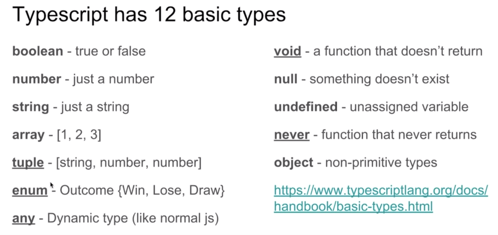

# Hello TypeScript

TypeScript 中，使用 `:` 指定变量的类型，`:` 的前后有没有空格都可以

TypeScript 只会进行静态检查，如果发现有错误，编译的时候就会报错

**TypeScript 编译的时候即使报错了，还是会生成编译结果**，我们仍然可以使用这个编译之后的文件

# 类型别名

使用 `type` 创建类型别名，类型别名常用于联合类型

# 字符串字面量类型

字符串字面量类型用来约束取值只能是某几个字符串中的一个

**类型别名与字符串字面量类型都是使用** `type` **进行定义**

```typescript
type EventNames = 'click' | 'scroll' | 'mousemove';
function handleEvent(ele: Element, event: EventNames) {
    // do something
}


handleEvent(document.getElementById('hello'), 'scroll');  // 没问题
handleEvent(document.getElementById('world'), 'dbclick'); // 报错，event 不能为 'dbclick'


// index.ts(7,47): error TS2345: Argument of type '"dbclick"' is not assignable to parameter of type 'EventNames'.
```

# 元组

数组合并了相同类型的对象，而元组（Tuple）合并了不同类型的对象

当添加越界的元素时，它的类型会被限制为元组中每个类型的联合类型

```typescript
let xcatliu: [string, number];
xcatliu = ['Xcat Liu', 25];
```

# 枚举

枚举（Enum）类型用于取值被限定在一定范围内的场景，比如一周只能有七天，颜色限定为红绿蓝等

未手动赋值的枚举项会接着上一个枚举项递增

如果未手动赋值的枚举项与手动赋值的重复了，TypeScript 是不会察觉到这一点的

常数枚举与普通枚举的区别是，它会在编译阶段被删除，并且不能包含计算成员

 外部枚举（Ambient Enums）是使用 `declare enum` 定义的枚举类型，`declare` 定义的类型只会用于编译时的检查，编译结果中会被删除

```typescript
declare enum Directions {
    Up,
    Down,
    Left,
    Right
}

let directions = [Directions.Up, Directions.Down, Directions.Left, Directions.Right];

declare enum Directions {
    Up,
    Down,
    Left,
    Right
}

let directions = [Directions.Up, Directions.Down, Directions.Left, Directions.Right];
```

# 类

虽然 JavaScript 中有类的概念，但是可能大多数 JavaScript 程序员并不是非常熟悉类，这里对类相关的概念做一个简单的介绍。

- 类(Class)：定义了一件事物的抽象特点，包含它的属性和方法
- 对象（Object）：类的实例，通过 `new` 生成
- 面向对象（OOP）的三大特性：封装、继承、多态
- 封装（Encapsulation）：将对数据的操作细节隐藏起来，只暴露对外的接口。外界调用端不需要（也不可能）知道细节，就能通过对外提供的接口来访问该对象，同时也保证了外界无法任意更改对象内部的数据
- 继承（Inheritance）：子类继承父类，子类除了拥有父类的所有特性外，还有一些更具体的特性
- 多态（Polymorphism）：由继承而产生了相关的不同的类，对同一个方法可以有不同的响应。比如 `Cat` 和 `Dog` 都继承自 `Animal`，但是分别实现了自己的 `eat` 方法。此时针对某一个实例，我们无需了解它是 `Cat` 还是 `Dog`，就可以直接调用 `eat` 方法，程序会自动判断出来应该如何执行 `eat`
- 存取器（getter & setter）：用以改变属性的读取和赋值行为
- 修饰符（Modifiers）：修饰符是一些关键字，用于限定成员或类型的性质。比如 `public` 表示公有属性或方法
- 抽象类（Abstract Class）：抽象类是供其他类继承的基类，抽象类不允许被实例化。抽象类中的抽象方法必须在子类中被实现
- 接口（Interfaces）：不同类之间公有的属性或方法，可以抽象成一个接口。接口可以被类实现（implements）。一个类只能继承自另一个类，但是可以实现多个接口

TypeScript 可以使用三种访问修饰符（Access Modifiers），分别是 `public`、`private` 和 `protected`。

- `public` 修饰的属性或方法是公有的，可以在任何地方被访问到，默认所有的属性和方法都是 `public` 的
- `private` 修饰的属性或方法是私有的，不能在声明它的类的外部访问，TypeScript 编译之后的代码中，并没有限制 `private` 属性在外部的可访问性，在子类中也是不允许访问的
- `protected` 修饰的属性或方法是受保护的，它和 `private` 类似，区别是它在子类中也是允许被访问的，允许在子类中访问

`abstract` 用于定义抽象类和其中的抽象方法

- 抽象类是不允许被实例化的
- 抽象类中的抽象方法必须被子类实现
- 即使是抽象方法，TypeScript 的编译结果中，仍然会存在这个类

一个类只能继承自另一个类，有时候不同类之间可以有一些共有的特性，这时候就可以把特性提取成接口（interfaces），用 `implements` 关键字来实现。这个特性大大提高了面向对象的灵活性

举例来说，门是一个类，防盗门是门的子类。如果防盗门有一个报警器的功能，我们可以简单的给防盗门添加一个报警方法。这时候如果有另一个类，车，也有报警器的功能，就可以考虑把报警器提取出来，作为一个接口，防盗门和车都去实现它

```typescript
interface Alarm {
    alert();
}


class Door {
}


class SecurityDoor extends Door implements Alarm {
    alert() {
        console.log('SecurityDoor alert');
    }
}


class Car implements Alarm {
    alert() {
        console.log('Car alert');
    }
}
```

一个类可以实现多个接口：

```typescript
interface Alarm {
    alert();
}


interface Light {
    lightOn();
    lightOff();
}


class Car implements Alarm, Light {
    alert() {
        console.log('Car alert');
    }
    lightOn() {
        console.log('Car light on');
    }
    lightOff() {
        console.log('Car light off');
    }
}
```

上例中，`Car` 实现了 `Alarm` 和 `Light` 接口，既能报警，也能开关车灯

接口与接口之间可以是继承关系

# 泛型

泛型（Generics）是指在定义函数、接口或类的时候，不预先指定具体的类型，而在使用的时候再指定类型的一种特性。

首先，我们来实现一个函数 `createArray`，它可以创建一个指定长度的数组，同时将每一项都填充一个默认值：

```typescript
function createArray(length: number, value: any): Array<any> {
    let result = [];
    for (let i = 0; i < length; i++) {
        result[i] = value;
    }
    return result;
}


createArray(3, 'x'); // ['x', 'x', 'x']
```

这段代码编译不会报错，但是一个显而易见的缺陷是，它并没有准确的定义返回值的类型：

`Array<any>` 允许数组的每一项都为任意类型。但是我们预期的是，数组中每一项都应该是输入的 `value` 的类型

```ts
function createArray<T>(length: number, value: T): Array<T> {
    let result: T[] = [];
    for (let i = 0; i < length; i++) {
        result[i] = value;
    }
    return result;
}


createArray<string>(3, 'x'); // ['x', 'x', 'x']
```

上例中，我们在函数名后添加了 `<T>`，其中 `T` 用来指代任意输入的类型，在后面的输入 `value: T` 和输出 `Array<T>` 中即可使用了。

接着在调用的时候，可以指定它具体的类型为 `string`。当然，也可以不手动指定，而让类型推论自动推算出来：

```ts
function createArray<T>(length: number, value: T): Array<T> {
    let result: T[] = [];
    for (let i = 0; i < length; i++) {
        result[i] = value;
    }
    return result;
}

createArray(3, 'x'); // ['x', 'x', 'x']
```

# TypeScript + React

```ts
function sum(a: number, b: number): number {
  	// 最后一个number是返回值的类型
    return a + b;
}

sum(1,2);
```



意义在于规定的数据的类型，规范了代码的书写，可以自动判断错误

 TypeScript有12种基本的数据类型

- boolean
- number
- string
- null
- undefined
- symbol
- object (array/function/object)

---

- tuple
- enum
- any
- void
- never

```ts
var jsarr = [1, "aa", 3]; // in JS is OK
var tsarr: [number] = [1, "aa", 3]; // in TS array is not OK
var tstuple: [number, string, number] = [1, "aa", 3]; // in TS tuple is OK
var tsany: any = [1, "aa", 3]; // TS any is always OK, because of its dynamic

function check(): void { // no return so set void
  console.log("check");
}
```

